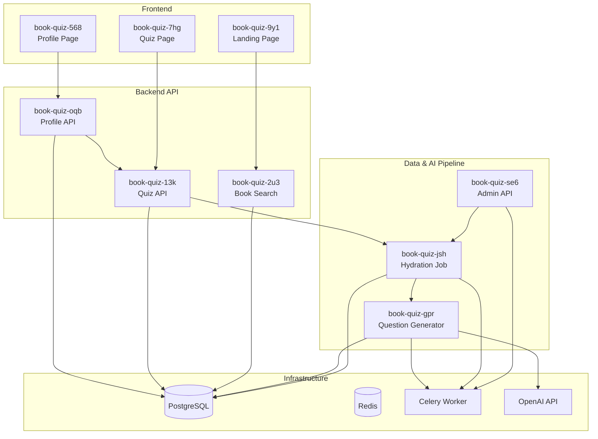

# Feature Architecture Plans — 9 status_plan Tasks

**Role:** Principal Software Architect
**Date:** 2026-08-02
**Source:** PROJECTS.md feature requirements, docs/ (ARCHITECTURE.md, API_DESIGN.md, DATA_MODEL.md, COMPONENT_TREE.md, DESIGN_DECISIONS.md), existing backend/ and frontend/ code

---

## Executive Summary

After a thorough review of the codebase, the 9 tasks fall into two tiers:

| Tier | Tasks | Status | Effort |
|------|-------|--------|--------|
| **Substantially complete** | book-quiz-2u3, book-quiz-9y1, book-quiz-13k, book-quiz-7hg, book-quiz-oqb | Production-grade with minor gaps | ~2 days polish |
| **Stubbed / requires implementation** | book-quiz-jsh, book-quiz-gpr, book-quiz-se6, book-quiz-568 | Core logic missing or hardcoded | ~8-10 days total |

The backend API layer (FastAPI + SQLAlchemy + JWT) is mature: all models, schemas, auth dependencies, and business logic are in place. The frontend React app has all pages built with routing, state management, and API integration — but the profile page is hardcoded and disconnected.

The critical gap is the **data hydration pipeline**: the Celery worker, web scraping, and OpenAI integration are stubs. Without this pipeline, the app has no books and no questions — it's structurally complete but operationally empty.

---

## Task-by-Task Architecture Plans

---

### TASK 1: book-quiz-jsh — Book Data Hydration Background Job

#### 1. What Already Exists

| Component | File | Status |
|-----------|------|--------|
| HydrationService class | `backend/app/services/hydration_service.py` | **STUB** — methods return `[]` and `0` |
| Celery dependency | `backend/requirements.txt` (celery==5.4.0, redis==5.2.1) | **Installed** |
| Redis config | `backend/app/core/config.py` (`redis_url`) | **Configured** |
| Book ORM model | `backend/app/models/book.py` | **Complete** |
| ADR-004 | `docs/DESIGN_DECISIONS.md` | **Design approved** |
| Worker process ref | `fly.toml` (`worker` process group) | **Declared, no code** |

**What's missing:**
1. **No Celery application instance** (`backend/app/worker.py`) — the file referenced in `fly.toml` does not exist
2. **`fetch_top_books_for_age()` is a pure stub** — no web scraping, no API calls, no book data source
3. **No book deduplication logic** — if the hydration job runs twice, books could be duplicated
4. **No chapter data acquisition** — the hydration service needs to fetch (or infer) chapter structure to feed the question generator

#### 2. Component Design

```
┌──────────────────────────────────────────────────────────────┐
│                  Hydration Pipeline                           │
│                                                              │
│  ┌──────────┐    ┌──────────────┐    ┌──────────────────┐   │
│  │ Web      │───▶│ Hydration    │───▶│ Question         │   │
│  │ Scraper  │    │ Service      │    │ Generator        │   │
│  │          │    │              │    │ (Celery chain)   │   │
│  └──────────┘    └──────┬───────┘    └────────┬─────────┘   │
│                         │                     │              │
│                         ▼                     ▼              │
│                    ┌──────────────────────────────────┐      │
│                    │         PostgreSQL                │      │
│                    │  books → questions → choices      │      │
│                    └──────────────────────────────────┘      │
└──────────────────────────────────────────────────────────────┘

Two-phase Celery workflow (chain):
  Phase 1: fetch_books_for_age(age, limit) → saves Book rows, returns book_ids
  Phase 2: For each book: generate_questions(book_id) → saves Question+Choice rows
```

**Design decisions:**

- **Web source**: Use the Google Books API (free tier, structured data) as primary source. Fallback: scrape Goodreads or Amazon best-seller lists. The Google Books API returns title, author, ISBN, cover image, description, and age ranges — all fields the Book model requires.
- **Deduplication**: Use `isbn` as the natural key (UNIQUE constraint already exists). On insert conflict, skip the book. Log skipped duplicates.
- **Chapter acquisition**: Google Books API does not return chapter information. Two options:
  1. Ask OpenAI to list chapters of a known book (the model knows popular books)
  2. Scrape a chapter listing from Wikipedia or a book summary site
  **Decision**: Use OpenAI (GPT-4o-mini) to generate a chapter list. Accept that for obscure books the chapter list may be approximate. This is a pragmatic trade-off given the education/quiz domain where the most-queried books are well-known.
- **Concurrency**: Celery worker pool of 2-4 concurrent workers. OpenAI API calls are I/O-bound, not CPU-bound.

#### 3. Data Flow & API Contract

```
POST /api/v1/admin/hydrate  (see task book-quiz-se6)
  │
  ▼
Celery Task Chain:
  hydrate_books_for_age(age: int, limit: int = 100)
    │
    ├─► 1. Fetch book list from source
    │     GET https://www.googleapis.com/books/v1/volumes?q=subject:juvenile&maxResults=40
    │     (multiple pages to reach `limit`)
    │
    ├─► 2. For each book dict {title, author, isbn, cover_url, age_range, description}:
    │     INSERT INTO books ... ON CONFLICT (isbn) DO NOTHING
    │     Collect new book IDs
    │
    └─► 3. For each new book_id, chain a subtask:
          generate_questions_task(book_id)
            │
            ├─► 3a. Get chapter list from OpenAI
            │       Prompt: "List the chapter titles for '{title}' by {author}. Return as JSON array."
            │
            └─► 3b. For each chapter, call QuestionGenerator.generate_for_chapter()
                  INSERT INTO questions + choices
```

**Key interface — `fetch_top_books_for_age` signature (after implementation):**

```python
def fetch_top_books_for_age(self, age: int, limit: int = 100) -> list[dict]:
    """
    Returns list of book metadata dicts:
    [
      {
        "title": "Harry Potter and the Sorcerer's Stone",
        "author": "J.K. Rowling",
        "isbn": "9780590353427",
        "cover_url": "https://...",
        "age_range_lower": 8,
        "age_range_upper": 12,
        "description": "..."  # from Google Books API
      },
      ...
    ]
    """
```

**Key interface — `generate_questions_for_book` signature (after implementation):**

```python
def generate_questions_for_book(self, book_id: UUID) -> int:
    """
    1. Look up book in DB
    2. Get chapter list from OpenAI
    3. For each chapter: call QuestionGenerator.generate_for_chapter()
    4. Bulk-insert Question + Choice rows
    Returns: total questions generated
    """
```

#### 4. Specific Files to Create/Modify

| File | Action | Description |
|------|--------|-------------|
| `backend/app/worker.py` | **CREATE** | Celery app instance, task definitions, broker config |
| `backend/app/services/hydration_service.py` | **MODIFY** | Implement `fetch_top_books_for_age()` with Google Books API; implement `generate_questions_for_book()` with OpenAI chapter list + question generation |
| `backend/app/services/question_generator.py` | **MODIFY** | Implement `generate_for_chapter()` with OpenAI API call |
| `backend/app/core/config.py` | **MODIFY** | Add Celery-specific configs (broker URL, result backend, concurrency) |
| `backend/requirements.txt` | **VERIFY** | Already has celery, redis, openai. May need `google-books-api` or just use `httpx` |

#### 5. Dependencies

```
book-quiz-jsh depends on:
  - book-quiz-se6 (admin API needed to trigger hydration)
  - book-quiz-gpr (QuestionGenerator is a dependency of hydration)
  - PostgreSQL + Redis must be running
```

---

### TASK 2: book-quiz-gpr — AI Question Generation Background Job

#### 1. What Already Exists

| Component | File | Status |
|-----------|------|--------|
| QuestionGenerator class | `backend/app/services/question_generator.py` | **STUB** — `generate_for_chapter()` returns `[]` |
| SYSTEM_PROMPT | `backend/app/services/question_generator.py` | **Complete** — detailed prompt with 8 rules |
| `_build_prompt()` | `backend/app/services/question_generator.py` | **Complete** — assembles user prompt from params |
| GeneratedQuestion dataclass | `backend/app/services/question_generator.py` | **Complete** |
| OpenAI config | `backend/app/core/config.py` (`openai_api_key`, `openai_model`) | **Configured** |
| Question + Choice models | `backend/app/models/question.py` | **Complete** |
| OpenAI package | `backend/requirements.txt` (openai==1.58.1) | **Installed** |

**What's missing:**
1. Actual OpenAI API call in `generate_for_chapter()`
2. Response parsing (structured JSON output from OpenAI)
3. Error handling for API failures (rate limits, bad responses, token limits)
4. Retry logic (OpenAI can be flaky)
5. Question type rotation/distribution logic (ensure mix of theme/fact/character/moral)

#### 2. Component Design

```
QuestionGenerator.generate_for_chapter(book_title, author, chapter_number, chapter_title, chapter_summary)
  │
  ├─► Build prompt using _build_prompt()
  │
  ├─► Call OpenAI Chat Completion API:
  │     model: gpt-4o-mini (fast, cheap, sufficient quality)
  │     response_format: { "type": "json_object" }  ← structured output mode
  │     temperature: 0.7 (enough variety, not too creative)
  │     max_tokens: 4000
  │
  ├─► Parse response JSON:
  │     {
  │       "questions": [
  │         {
  │           "question_text": "...",
  │           "question_type": "theme|fact|character|moral|interpretation",
  │           "difficulty": "easy|medium|hard",
  │           "choices": [
  │             {"text": "...", "is_correct": false},
  │             {"text": "...", "is_correct": true},
  │             ...
  │           ]
  │         },
  │         ...  (total 10)
  │       ]
  │     }
  │
  └─► Return list[GeneratedQuestion]
```

**Question type distribution (per chapter of 10 questions):**

| Type | Count | Focus |
|------|-------|-------|
| `theme` | 2 | Main theme/idea of the chapter |
| `fact` | 3 | Key events, plot points, details |
| `character` | 2 | Character motivations, emotions, development |
| `moral` | 1 | Moral lessons, outcomes |
| `interpretation` | 2 | Comprehension, inference, language |

**Design decisions:**

- **Structured Output**: Use OpenAI's `response_format: { "type": "json_object" }` (GPT-4o-mini supports this) for guaranteed valid JSON. The `SYSTEM_PROMPT` already instructs the model to output JSON.
- **Chapter summary**: For popular books, OpenAI knows the chapter contents intrinsically. For obscure books, the hydration service provides a chapter title and a short description from the web source. As a minimum viable strategy, send just `chapter_title` + `chapter_number` and let the model's pretraining fill in the gaps.
- **Rate limiting**: OpenAI free tier has 3 RPM for gpt-4o-mini. Paid tier: 500 RPM. Use Celery's rate limiting (`rate_limit="10/m"`) and exponential backoff in the task.
- **Validation**: After parsing the JSON response, validate that exactly 10 questions exist, each has exactly 4 choices, and exactly 1 choice per question is correct. If validation fails, retry the API call once; if it fails again, log the error and skip that chapter (don't block the whole book).

#### 3. Data Flow & API Contract

The QuestionGenerator is a **synchronous service** called from within a Celery task. It's not exposed as an API endpoint.

```python
# Service interface (after implementation)
class QuestionGenerator:
    def __init__(self, api_key: str, model: str = "gpt-4o-mini"):
        self.client = OpenAI(api_key=api_key)
        self.model = model

    def generate_for_chapter(
        self,
        book_title: str,
        author: str,
        chapter_number: int,
        chapter_title: str,
        chapter_summary: str,
    ) -> list[GeneratedQuestion]:
        """Returns 10 GeneratedQuestion objects, or raises QuestionGenerationError."""
        ...

    def get_chapter_list(self, book_title: str, author: str) -> list[dict]:
        """Ask OpenAI to list chapters. Returns [{"number": 1, "title": "..."}, ...]."""
        ...
```

#### 4. Specific Files to Create/Modify

| File | Action | Description |
|------|--------|-------------|
| `backend/app/services/question_generator.py` | **MODIFY** | Implement `generate_for_chapter()` with OpenAI API; add `get_chapter_list()` method; add response validation; add `QuestionGenerationError` exception class |
| `backend/app/services/hydration_service.py` | **MODIFY** | Call `QuestionGenerator.get_chapter_list()` before generating per-chapter questions |

#### 5. Dependencies

```
book-quiz-gpr depends on:
  - OPENAI_API_KEY environment variable must be set
  - Existing Question + Choice ORM models
  - book-quiz-jsh (hydration service calls question generator)
```

---

### TASK 3: book-quiz-se6 — Hydration Management API

#### 1. What Already Exists

| Component | File | Status |
|-----------|------|--------|
| `admin_api_key` config | `backend/app/core/config.py` | **Configured** — empty default, production-enforced |
| Admin API design | `docs/API_DESIGN.md` | **Specified** — POST /admin/hydrate, GET /admin/hydrate/{task_id}/status |
| `get_current_user` dependency | `backend/app/core/security.py` | **Exists** — can be adapted as pattern for admin auth |
| API router registration | `backend/app/main.py` | **Missing** — no admin router included |

**What's missing:**
1. No `backend/app/api/admin.py` file
2. No admin authentication dependency (similar to `get_current_user` but checks a header key)
3. No Celery task invocation from the API
4. No task status tracking (Celery's built-in `AsyncResult` or custom status table)

#### 2. Component Design

```
Admin API (requires X-Admin-Key header):
  POST /api/v1/admin/hydrate
    Body: { "age": 10, "limit": 100 }
    → Validates admin key
    → Dispatches Celery task
    → Returns 202 { "task_id": "uuid", "status": "processing" }

  GET /api/v1/admin/hydrate/{task_id}/status
    → Validates admin key
    → Queries Celery AsyncResult for task status
    → Returns { "task_id": "...", "status": "pending|processing|completed|failed",
                 "books_processed": N, "questions_generated": N, "errors": [...] }

  GET /api/v1/admin/hydrate
    → Lists recent hydration jobs (last 50)
```

**Design decisions:**

- **Admin auth pattern**: Accept `X-Admin-Key` header (not Bearer token). This is simpler than JWT for an internal admin API and matches the `admin_api_key` config. Create a `get_admin_auth` FastAPI dependency that validates the header.
- **Task status**: Use Celery's `AsyncResult(task_id)` to poll status. No need for a custom status table — Celery result backend (Redis) handles this.
- **Result persistence**: Configure Celery with `result_expires=86400` (24h) so task results are available for polling. After expiry, status endpoint returns a "task expired" response.
- **Idempotency**: Allow re-hydration of the same age group. The ON CONFLICT (isbn) DO NOTHING pattern prevents book duplication. Force re-generation of questions by checking if a book already has questions; skip or force-regenerate based on a `force` parameter.

#### 3. API Contract

```
POST /api/v1/admin/hydrate
Headers: X-Admin-Key: <key>
Request:  { "age": 10, "limit": 100, "force": false }
Response 202:
{
  "task_id": "550e8400-e29b-41d4-a716-446655440000",
  "status": "processing",
  "message": "Hydration job started for age 10"
}

GET /api/v1/admin/hydrate/{task_id}/status
Headers: X-Admin-Key: <key>
Response 200:
{
  "task_id": "550e8400-...",
  "status": "completed",        # pending | processing | completed | failed
  "books_processed": 87,         # 13 were duplicates
  "questions_generated": 1305,   # 87 books × ~15 chapters × 10 Qs
  "errors": [
    {"book": "Obscure Book Title", "error": "Failed to generate: rate limited"}
  ]
}
```

#### 4. Specific Files to Create/Modify

| File | Action | Description |
|------|--------|-------------|
| `backend/app/api/admin.py` | **CREATE** | Admin router with hydrate + status endpoints |
| `backend/app/core/security.py` | **MODIFY** | Add `get_admin_auth` dependency (validates `X-Admin-Key` header) |
| `backend/app/main.py` | **MODIFY** | Register admin router |
| `backend/app/schemas/admin.py` | **CREATE** | Pydantic schemas for hydrate request/response, status response |
| `backend/tests/acceptance/test_admin_hydration.py` | **CREATE** | Acceptance tests for hydrate + status |

#### 5. Dependencies

```
book-quiz-se6 depends on:
  - book-quiz-jsh (Celery tasks must exist to be dispatched)
  - Admin auth pattern from existing security.py
  - Redis must be running (Celery broker)
```

---

### TASK 4: book-quiz-2u3 — Book Search API Endpoint

#### 1. What Already Exists

| Component | File | Status |
|-----------|------|--------|
| Search endpoint | `backend/app/api/books.py` | **Functional** — ILIKE-based, paginated |
| Book schemas | `backend/app/schemas/book.py` | **Complete** |
| Book model with indexes | `backend/app/models/book.py` | **Complete** |
| GIN trigram index | `backend/alembic/versions/0001_initial.py` | **Created** — `idx_books_title_trgm` |
| Book detail endpoint | `backend/app/api/books.py` (`GET /books/{id}`) | **Functional** |
| Frontend search | `frontend/src/pages/SearchResultsPage.tsx` + `Layout.tsx` | **Functional** |

**What's missing:**
1. **Search does NOT use the GIN trigram index.** The current query uses `title.ilike(f'%{term}%')` which does a sequential scan. The trigram index (GIN on `gin_trgm_ops`) exists in the DB but no query uses it.
2. No true fuzzy matching — typos in search terms won't match (e.g., "Harry Poter" won't find "Harry Potter")
3. No `pg_trgm` query operators are used (`similarity()`, `word_similarity()`, `<%>`, `<->`)

#### 2. Component Design

The fix is to switch from `ILIKE` to PostgreSQL trigram similarity operators:

```python
# Current (sequential scan):
query = query.filter(Book.title.ilike(f'%{term}%'))

# Proposed (uses GIN trigram index):
from sqlalchemy import func, or_
similarity_threshold = 0.2  # 0.0 to 1.0; lower = more tolerant of typos

query = query.filter(
    or_(
        func.similarity(Book.title, term) > similarity_threshold,
        Book.isbn == term.strip(),   # exact ISBN match
    )
).order_by(
    func.similarity(Book.title, term).desc()  # most similar first
)
```

**Key design decisions:**

- **Threshold**: `0.2` provides good typo tolerance. Can be tuned or made configurable.
- **Fallback**: If trigram search returns 0 results, fall back to ILIKE `%term%` as a safety net (trigram can miss very short terms).
- **Performance**: GIN index on `gin_trgm_ops` handles this efficiently for < 100K books. The `similarity()` function is not indexable directly, but the `%` operator (similarity) does use the GIN index when combined with a threshold via `set_limit()`.
- **ISBN exact match**: Keep the exact ISBN equality check (uses the btree index on `isbn`).

**Alternative considered and rejected:**
- Elasticsearch: Overkill for < 10K books. Adds operational complexity. Per ADR-002, migrate to ES "later if search becomes a bottleneck." We're not there yet.
- Full PostgreSQL FTS (`tsvector`/`tsquery`): Better for natural language search, but `pg_trgm` is simpler and handles typos better, which is the primary requirement.

#### 3. Data Flow & API Contract

The API contract remains unchanged from `docs/API_DESIGN.md`:

```
GET /api/v1/books?q=harry+poter&page=1&size=20
Response 200:
{
  "items": [ { "id": "...", "title": "Harry Potter...", ... } ],
  "total": 1,
  "page": 1,
  "size": 20
}
```

The only change is the backend query implementation.

#### 4. Specific Files to Create/Modify

| File | Action | Description |
|------|--------|-------------|
| `backend/app/api/books.py` | **MODIFY** | Replace ILIKE with `pg_trgm` similarity query; add fallback logic |
| `backend/tests/acceptance/test_book_search.py` | **CREATE** | Acceptance tests: exact match, typo match, ISBN match, empty result, pagination |

#### 5. Dependencies

```
book-quiz-2u3 depends on:
  - Alembic migration 0001_initial (pg_trgm extension + GIN index must exist)
  - Book model (complete)
  - Hydration pipeline (books must exist to be searchable)
```

---

### TASK 5: book-quiz-9y1 — Landing Page with Search

#### 1. What Already Exists

| Component | File | Status |
|-----------|------|--------|
| Landing page | `frontend/src/pages/LandingPage.tsx` | **Complete** — hero, search bar, "How it works" 3-step cards |
| Header/Layout | `frontend/src/components/Layout.tsx` | **Complete** — logo, search bar, auth buttons |
| Auth buttons | `frontend/src/components/Layout.tsx` | **Complete** — login/signup when logged out; user name + logout when logged in |
| Routing | `frontend/src/App.tsx` | **Complete** — all routes configured |
| E2E test | `frontend/e2e/landing-page.spec.ts` | **Exists** — tests search bar visibility, auth buttons, empty search state |

**What's missing:**
1. **Minor UX polish**: The search on the landing page navigates to `/search?q=...` but there's no loading state or autocomplete suggestions during typing.
2. **Auth buttons**: The signup page redirects to `/login` after registration instead of automatically logging in (minor UX friction).
3. No featured/popular books section on landing (nice-to-have, not critical).

#### 2. Component Design

The landing page structure is already well-implemented following `docs/COMPONENT_TREE.md`:

```
<Layout>
  <Header>
    <Logo />
    <SearchBar />          ← mini search in header
    <AuthButtons />        ← conditional Login/SignUp/UserMenu
  </Header>
  <Outlet>
    <LandingPage>
      <HeroSection>
        <Heading />
        <SubHeading />
        <SearchBar />      ← primary search (large)
      </HeroSection>
      <HowItWorks />       ← 3 cards: Search → Quiz → Track
    </LandingPage>
  </Outlet>
</Layout>
```

**Minor improvements planned:**

1. Add `autoFocus` to the landing page search bar for immediate typing
2. Wire the "View my profile" link on QuizCompletePage to actual profile data (requires book-quiz-568)
3. Consider debouncing the search input for a smoother UX (no API call needed — search is client-side navigation)

#### 3. Data Flow

```
User types book title → Enter or click "Search"
  → navigate(`/search?q=${encodeURIComponent(query)}`)
  → SearchResultsPage loads
  → React Query: GET /api/v1/books?q=...
  → Results displayed as BookCard grid
```

No backend changes needed — this is purely a frontend task and is already ~95% complete.

#### 4. Specific Files to Create/Modify

| File | Action | Description |
|------|--------|-------------|
| `frontend/src/pages/LandingPage.tsx` | **MODIFY** | Add `autoFocus` to search input; optionally add featured books section |
| `frontend/src/pages/SignUpPage.tsx` | **MODIFY** | Auto-login after registration or improve redirect experience |

#### 5. Dependencies

```
book-quiz-9y1 depends on:
  - Layout component (exists)
  - Auth store (exists)
  - Search results page (exists — book-quiz-2u3 for backend search)
```

---

### TASK 6: book-quiz-13k — Quiz Start and Answer API Endpoints

#### 1. What Already Exists

| Component | File | Status |
|-----------|------|--------|
| `POST /quizzes/start` | `backend/app/api/quiz.py` | **Complete** — random 10 Qs, excludes answered, retake logic, guest support |
| `POST /quizzes/{id}/answer` | `backend/app/api/quiz.py` | **Complete** — validation, correctness check, duplicate prevention |
| `POST /quizzes/{id}/complete` | `backend/app/api/quiz.py` | **Complete** — score calculation, result items |
| Attempt/Answer models | `backend/app/models/quiz.py` | **Complete** |
| Quiz schemas | `backend/app/schemas/quiz.py` | **Complete** |
| `get_optional_current_user` | `backend/app/core/security.py` | **Complete** |

**What's missing:**
1. **Attempt ownership validation**: Any caller can answer/complete any attempt by ID. There's no check that `attempt.user_id` matches `current_user.id` for authenticated users.
2. **Guest email capture is no-op**: The `complete` endpoint accepts `email` but does nothing with it (no storage, no email sending).
3. **No `correct_choice_id` returned on incorrect answers**: `quiz.py:124-126` only returns the `correct_choice_id` when the answer is correct (`if is_correct else ""`). This is intentional for security but inconsistent — the frontend shows feedback regardless.
4. **Minor**: `request: CompleteQuizRequest = CompleteQuizRequest()` mutable default anti-pattern (line 142).

#### 2. Component Design

The quiz flow is already well-implemented. Here are the targeted fixes:

**Fix 1: Attempt ownership validation**

```python
# In answer_question and complete_quiz, after loading the attempt:
if attempt.user_id is not None:
    # This is an authenticated attempt — verify ownership
    if current_user is None or attempt.user_id != current_user.id:
        raise HTTPException(403, "This quiz attempt belongs to another user.")
```

Add `current_user: User | None = Depends(get_optional_current_user)` to `answer_question` and `complete_quiz` (currently they don't accept the user dependency).

**Fix 2: Guest email handling**

Store the guest email on the `QuizAttempt` record if provided. Add an optional `guest_email` column to `quiz_attempts`:

```python
# Migration needed:
# ALTER TABLE quiz_attempts ADD COLUMN guest_email VARCHAR(255);
```

Alternatively (simpler, no migration): store in the existing flow, just log it. The "send results" notification can be a follow-up feature.

**Fix 3: Always return correct_choice_id**

Change `quiz.py:124` from:
```python
correct_choice_id=str(choice.id) if is_correct else "",
```
to:
```python
# Find the correct choice
correct_choice = db.query(Choice).filter(
    Choice.question_id == qid, Choice.is_correct.is_(True)
).first()
correct_choice_id = str(correct_choice.id) if correct_choice else "",
```

#### 3. Data Flow & API Contract

The API contract is documented in `docs/API_DESIGN.md` and matches the implementation. No contract changes needed — only behavioral fixes.

```
POST /quizzes/start    → 201 { attempt_id, questions[] }          [no auth needed]
POST /quizzes/:id/answer  → 200 { is_correct, correct_choice_id } [no auth]
POST /quizzes/:id/complete → 200 { score, total, results[] }       [no auth; email opt]
```

#### 4. Specific Files to Create/Modify

| File | Action | Description |
|------|--------|-------------|
| `backend/app/api/quiz.py` | **MODIFY** | Add attempt ownership check; always return correct_choice_id; fix mutable default; wire current_user to answer/complete |
| `backend/app/models/quiz.py` | **MODIFY** | Optional: add `guest_email` column (needs migration) |
| `backend/alembic/versions/0002_guest_email.py` | **CREATE** (if doing guest_email) | Migration: add guest_email to quiz_attempts |
| `backend/tests/acceptance/test_quiz_flow.py` | **CREATE** | Acceptance tests: guest quiz, authenticated quiz, retake, ownership enforcement |

#### 5. Dependencies

```
book-quiz-13k depends on:
  - Question + Choice data must exist (hydration pipeline)
  - Auth system (get_optional_current_user)
  - Book model
```

---

### TASK 7: book-quiz-7hg — Quiz-Taking Page

#### 1. What Already Exists

| Component | File | Status |
|-----------|------|--------|
| Quiz page | `frontend/src/pages/QuizPage.tsx` | **Complete** — progress bar, one Q at a time, choice selection, feedback, guest email |
| Quiz complete page | `frontend/src/pages/QuizCompletePage.tsx` | **Complete** — score display, answer breakdown |
| Quiz state store | `frontend/src/stores/quizStore.ts` | **Complete** — phase tracking, answers, navigation |
| API integration | `frontend/src/services/api.ts` (`quizApi`) | **Complete** |

**What's missing:**
1. **Loading/error states**: The QuizPage and QuizCompletePage have minimal error handling (`console.error`). Users see nothing on failure.
2. **Choice position consistency**: The backend shuffles choices per quiz start (good for cheating prevention), but the frontend always displays A/B/C/D labels based on the shuffled position sent by the server. This is correct behavior already — verify it's consistent.
3. **Retake flow**: After completing a quiz, the "Retake" button exists but just navigates back to the book detail page. The retake flow (re-starting a quiz for the same book) works via the backend's question exclusion logic but needs a smoother frontend experience.
4. **Guest email capture UX**: The email input only appears on the last question after answering. This is functional but could be more prominent.

#### 2. Component Design

The component tree from `docs/COMPONENT_TREE.md` is implemented verbatim:

```
<QuizPage>
  <QuizProgress>
    <ProgressBar />          ← filled bar with percentage
    <QuestionCounter />      ← "Question 3 of 10"
  </QuizProgress>
  <QuestionCard>
    <QuestionText />         ← chapter info + question
    <ChoiceList>
      <ChoiceButton />*      ← 4 choices (A/B/C/D)
    </ChoiceList>
    <FeedbackOverlay />      ← ✅ Correct! / ❌ Incorrect.
  </QuestionCard>
  <QuizNavigation>
    <NextButton />           ← becomes "Finish Quiz" on last Q
  </QuizNavigation>
  <GuestEmailCapture />      ← email input on last Q (optional)
</QuizPage>
```

**Planned improvements:**

1. Add `isError` / `isLoading` states for API calls (use React Query `useMutation` instead of raw `quizApi` calls)
2. Add a toast/notification for API errors instead of silent `console.error`
3. Confirmation dialog before finishing quiz ("You've answered X of Y questions. Are you sure?")
4. Preserve quiz state in sessionStorage so a page refresh doesn't lose progress (currently the Zustand store is not persisted)

#### 3. Data Flow

```
1. User clicks "Start Quiz" on BookDetailPage
2. BookDetailPage calls quizApi.start(bookId)
3. → POST /api/v1/quizzes/start → { attempt_id, questions[] }
4. QuizPage loads, displays first question
5. User selects choice → POST /quizzes/:id/answer → { is_correct, correct_choice_id }
6. Feedback shown, "Next" button appears
7. After last question → POST /quizzes/:id/complete → { score, results[] }
8. Navigate to /quiz/:id/complete
```

#### 4. Specific Files to Create/Modify

| File | Action | Description |
|------|--------|-------------|
| `frontend/src/pages/QuizPage.tsx` | **MODIFY** | Add error/loading states; persist quiz state; improve email capture UX; add confirmation on finish |
| `frontend/src/pages/QuizCompletePage.tsx` | **MODIFY** | Add error state; connect retake button to re-start flow |
| `frontend/src/stores/quizStore.ts` | **MODIFY** | Add `persist` middleware for quiz state survival on refresh |
| `frontend/src/services/api.ts` | **VERIFY** | Quiz API methods are correct |

#### 5. Dependencies

```
book-quiz-7hg depends on:
  - book-quiz-13k (quiz API endpoints)
  - quizStore (exists)
  - React Router (exists)
```

---

### TASK 8: book-quiz-oqb — User Profile API Endpoint

#### 1. What Already Exists

| Component | File | Status |
|-----------|------|--------|
| `GET /users/me/profile` | `backend/app/api/profile.py` | **Complete** — book progress, attempt history, best scores |
| `GET /users/me/books/{id}/progress` | `backend/app/api/profile.py` | **Complete** — per-book detail |
| Profile schema | `backend/app/api/profile.py` (`ProfileResponse`) | **Complete** |
| Auth dependency | `backend/app/core/security.py` (`get_current_user`) | **Complete** |

**What's missing:**
1. **`remaining_questions` and `can_retake` fields** from the API design doc are not present in the response
2. **`cover_url`** is not included in the `BookProgress` response (frontend needs it for book cards)
3. The `best_score` is computed correctly, but as an absolute score. The API design shows `best_score` as a percentage (0–100). Currently it's the raw count.
4. No `total_questions` in the BookProgress response (needed to compute "X of Y questions answered")

#### 2. Component Design

The profile API is nearly complete. The fixes needed are additive — adding missing fields:

```python
class BookProgress(BaseModel):
    book_id: str
    title: str
    author: str
    cover_url: str | None = None            # ADD
    attempts: list[AttemptSummary]
    best_score: int = 0                      # percentage (0-100)
    total_questions_answered: int = 0
    total_questions: int = 0                 # ADD: total Qs available for this book
    remaining_questions: int = 0             # ADD: total - answered
    can_retake: bool = False                 # ADD: True if all Qs exhausted
```

**Logic for new fields:**
- `total_questions`: `db.query(func.count(Question.id)).filter(Question.book_id == book_id).scalar()`
- `remaining_questions`: `total_questions - total_questions_answered`
- `can_retake`: `remaining_questions == 0` (all questions exhausted, user must retake)
- `cover_url`: from `Book.cover_url` (pass through)
- `best_score`: compute as percentage: `max(score/total*100 for each attempt)` — this is already done implicitly; make it explicit

#### 3. Data Flow & API Contract

Matches `docs/API_DESIGN.md` with the addition of the fields above:

```
GET /api/v1/users/me/profile
Authorization: Bearer <token>
Response 200:
{
  "id": "uuid",
  "email": "user@example.com",
  "display_name": "Alice",
  "total_quizzes": 5,
  "total_questions_answered": 50,
  "books": [
    {
      "book_id": "uuid",
      "title": "Harry Potter...",
      "author": "...",
      "cover_url": "https://...",
      "attempts": [...],
      "best_score": 90,
      "total_questions_answered": 20,
      "total_questions": 150,
      "remaining_questions": 130,
      "can_retake": false
    }
  ]
}
```

#### 4. Specific Files to Create/Modify

| File | Action | Description |
|------|--------|-------------|
| `backend/app/api/profile.py` | **MODIFY** | Add missing fields to `BookProgress`; compute `total_questions`, `remaining_questions`, `can_retake`, `cover_url`; fix `best_score` to percentage |
| `backend/app/schemas/profile.py` | **CREATE** | Extract profile schemas from api/profile.py (separation of concerns) |
| `backend/tests/acceptance/test_profile.py` | **CREATE** | Acceptance tests: authenticated profile, empty profile, multi-book, retake logic |

#### 5. Dependencies

```
book-quiz-oqb depends on:
  - Auth system (get_current_user)
  - Quiz attempt data (users must have taken quizzes)
  - Book + Question models
```

---

### TASK 9: book-quiz-568 — Profile Page (Frontend)

#### 1. What Already Exists

| Component | File | Status |
|-----------|------|--------|
| Profile page | `frontend/src/pages/ProfilePage.tsx` | **HARDCODED** — shows static "0" stats, "No books completed" message |
| Auth store | `frontend/src/stores/authStore.ts` | **Complete** — user info available |
| API service | `frontend/src/services/api.ts` | **Missing** — no `profileApi` method |
| Types | `frontend/src/types/index.ts` | **Partial** — `UserProfile`, `BookProgress`, `AttemptSummary` types exist |
| Route | `frontend/src/App.tsx` (`/profile`) | **Configured** |

**What's missing:**
1. **No API call to fetch profile data** — the page is completely static
2. **No `profileApi` in the API service** — no method to call `GET /api/v1/users/me/profile`
3. **No React Query integration** — no `useQuery` for fetching profile
4. **No loading/error/empty states** — just a static "no data" render
5. **No book progress cards** — the UI for displaying individual book progress with attempt history
6. **No attempt history drill-down** — clicking a book should show attempt history details

#### 2. Component Design

The component tree from `docs/COMPONENT_TREE.md`:

```
<ProfilePage>
  <ProfileHeader>
    <Avatar />              ← user initial or gravatar
    <UserStats />           ← total quizzes, questions, best score
  </ProfileHeader>
  <BookProgressList>
    <BookProgressCard />*   ← one per book
      <BookCover />
      <BookInfo />          ← title, author, best score
      <AttemptHistory />    ← expandable: attempt #, score, date
      <ContinueButton />    ← "Continue Quiz" or "Retake" link
  </BookProgressList>
</ProfilePage>
```

**State management:**

| State | Pattern |
|-------|---------|
| Profile data | React Query (`useQuery` with key `['profile']`) |
| UI state (expanded book) | `useState` — which book card has attempt history expanded |
| Auth guard | Check `isAuthenticated` from authStore; redirect to `/login` if not |

#### 3. Data Flow

```
1. User navigates to /profile
2. Auth guard: isAuthenticated? → no → redirect /login
3. React Query: GET /api/v1/users/me/profile
4. Loading: <Skeleton /> cards
5. Success: render <ProfileHeader> + <BookProgressCard> list
6. Error: show error message with retry button
7. Empty state (no quizzes): "No books completed yet. Search for a book and take your first quiz!"
```

#### 4. Specific Files to Create/Modify

| File | Action | Description |
|------|--------|-------------|
| `frontend/src/services/api.ts` | **MODIFY** | Add `profileApi.getProfile()` and `profileApi.getBookProgress(bookId)` |
| `frontend/src/pages/ProfilePage.tsx` | **REWRITE** | Full implementation with React Query, loading/error/empty states, book cards, attempt history |
| `frontend/src/components/BookProgressCard.tsx` | **CREATE** | Book progress card component (cover, info, score, attempt history) |
| `frontend/src/components/AttemptHistory.tsx` | **CREATE** | Expandable attempt history list |
| `frontend/src/components/ProfileHeader.tsx` | **CREATE** | User info + stats summary |
| `frontend/src/components/UserStats.tsx` | **CREATE** | Stats grid (quizzes, questions, best score) |
| `frontend/src/hooks/useProfile.ts` | **CREATE** | React Query hook for profile data with cache invalidation |

#### 5. Dependencies

```
book-quiz-568 depends on:
  - book-quiz-oqb (profile API must return correct data)
  - authStore (for user info and auth guard)
  - React Router (for navigation)
  - Quiz flow (must have taken quizzes to display data)
```

---

## Cross-Cutting Dependency Diagram



**Build order recommendation:**

```
Phase 1 (Foundation — can be parallelized):
  [book-quiz-gpr] → [book-quiz-jsh] → [book-quiz-se6]

Phase 2 (Backend polish):
  [book-quiz-2u3] + [book-quiz-13k] + [book-quiz-oqb]
  (all independent of each other, can be parallelized)

Phase 3 (Frontend):
  [book-quiz-7hg] → [book-quiz-9y1] → [book-quiz-568]
  (profile page depends on profile API)
```

---

## Risk Assessment

| Risk | Severity | Mitigation |
|------|----------|------------|
| OpenAI API rate limiting blocks hydration | **High** | Implement exponential backoff + Celery retry; use gpt-4o-mini (higher RPM limits); cache chapter lists |
| Google Books API quota exceeded | **Medium** | Implement multiple fallback sources; cache results; rate limit hydration jobs to 1/hour |
| Chapter data missing for obscure books | **Medium** | Accept approximate chapters from OpenAI; flag books with < 5 chapters for manual review |
| pg_trgm similarity misses short search terms (< 3 chars) | **Low** | Fall back to ILIKE for short terms; document minimum search length of 3 chars |
| Quiz store lost on page refresh | **Medium** | Implement persist middleware in Zustand; store attemptId in URL, fetch quiz state from server on reload |
| Profile page shows stale quiz results | **Low** | Invalidate React Query cache after quiz completion; use `queryClient.invalidateQueries(['profile'])` |
| Admin API key exposure | **High** | Already mitigated: empty default, production startup validation fails without it, header-based auth |
| Celery worker crashes during hydration | **Medium** | Task retry with exponential backoff; partial progress saved per book; idempotent book insertion |

---

## Technology Stack Summary

| Layer | Technology | Purpose |
|-------|-----------|---------|
| Frontend | React 18 + TypeScript | SPA with client-side routing |
| Routing | react-router-dom v7 | Page navigation, URL params |
| Server state | React Query (TanStack) | API data fetching, caching, invalidation |
| Client state | Zustand + persist | Auth tokens, quiz progress |
| Styling | Tailwind CSS | Utility-first responsive design |
| Backend | FastAPI + Python 3.12 | REST API, async request handling |
| ORM | SQLAlchemy 2.0 | Declarative models, query building |
| Validation | Pydantic v2 | Request/response schemas, settings |
| Auth | python-jose (JWT) + bcrypt | Stateless token auth, password hashing |
| Background tasks | Celery 5.x + Redis | Book hydration, AI question generation |
| Database | PostgreSQL 16 | Primary data store, GIN trigram search |
| Cache/Broker | Redis 7 | Celery broker, result backend |
| AI | OpenAI API (gpt-4o-mini) | Question generation, chapter listing |
| Book data | Google Books API | Book metadata (title, author, ISBN, cover) |

---

## ADR-008: Data Hydration Source Strategy

**Status**: Proposed
**Date**: 2026-08-02

**Context**: The hydration pipeline needs a reliable source for top books per age group (6-18). Existing apps in the space curate data manually or partner with publishers. We need an automated, scalable approach with zero manual curation.

**Decision**: Use Google Books API as the primary source with OpenAI as the fallback for chapter-level data.

**Primary source** (`fetch_top_books_for_age`):
- Google Books API `volumes.list` with `q=subject:juvenile+fiction&orderBy=relevance&maxResults=40`
- Filter by `age_range` (Google Books sometimes provides this; when missing, estimate from reading level)
- Extract: `title`, `authors`, `industryIdentifiers` (ISBN-13), `imageLinks.thumbnail` (cover), `description`

**Chapter source** (`get_chapter_list`):
- Ask OpenAI: *"List the chapter titles for the book '{title}' by {author}. Return as a JSON array of objects with 'number' and 'title' fields. If you don't know, return your best estimate based on the book's content."*
- Rationale: Popular children's/YA books are well-represented in OpenAI's training data. For obscure books, approximate chapters are acceptable — the questions will still be generated, just with approximate chapter boundaries.

**Consequences**:
- ✅ Fully automated, no manual curation
- ✅ Google Books API is free for up to 1000 requests/day
- ✅ OpenAI knows most popular books intrinsically
- ❌ Chapter lists may be approximate for less popular books
- ❌ Google Books API has rate limits (1000/day) — need to batch hydration across multiple days for full coverage (100 books × 13 ages = 1300 books)
- ❌ Some metadata may be missing (age range, cover image)

**Alternatives considered and rejected:**
- **Goodreads scraping**: Violates ToS; requires HTML parsing; fragile
- **Amazon Product Advertising API**: Requires affiliate account; complex approval; limited to 1 req/sec
- **Open Library API**: Free and open, but data quality for children's books is poor and age ranges are rarely available
- **Manual CSV**: Doesn't scale; defeats the purpose of automated hydration

---

## ADR-009: Question Generation Quality Assurance

**Status**: Proposed
**Date**: 2026-08-02

**Context**: AI-generated questions may contain errors (incorrect "correct" answers, poorly formed distractors, misleading questions). We need a quality gate before questions are served to users.

**Decision**: Implement a two-tier validation: automated structural validation at generation time + optional manual review flag.

**Automated validation** (runs inside `generate_for_chapter`):
1. Exactly 10 questions returned
2. Each question has exactly 4 choices
3. Exactly 1 choice per question is marked correct
4. No duplicate question text within the same chapter
5. All required fields present (`question_text`, `choices[].text`, `choices[].is_correct`)
6. Question types and difficulties are from the allowed enum sets

If validation fails, retry once with a modified prompt: *"The previous response had validation errors. Please ensure..."*. If it fails again, log and skip that chapter; all other chapters proceed.

**Manual review flag** (optional, future):
- Add `needs_review: bool = True` column to `questions` table
- Questions from the first hydration run are auto-flagged for review
- Admin can approve questions via a future admin UI
- Unreviewed questions are still served to users (the alternative — blocking all questions — would make the app useless until review)

**Consequences**:
- ✅ Catches gross errors (wrong JSON, missing fields) automatically
- ✅ Partial hydration still works (failed chapters don't block the book)
- ❌ Cannot detect subtle factual errors (e.g., wrong correct answer about a plot point) — requires human review
- ❌ Adding `needs_review` column requires a migration

---

## Summary Checklist

| Task | Current State | Work Required | Estimated Effort |
|------|--------------|---------------|------------------|
| book-quiz-jsh | Stub (returns `[]`) | Full implementation: Celery worker, Google Books API integration, dedup logic | 3-4 days |
| book-quiz-gpr | Stub (returns `[]`) | Full implementation: OpenAI API calls, response parsing, validation | 2-3 days |
| book-quiz-se6 | Missing entirely | Create admin API, auth dependency, Celery dispatch | 1-2 days |
| book-quiz-2u3 | ILIKE search (works but slow) | Replace with pg_trgm similarity query | 0.5 day |
| book-quiz-9y1 | 95% complete | Minor UX polish (autoFocus, login redirect) | 0.5 day |
| book-quiz-13k | 90% complete | Add attempt ownership, fix correct_choice_id, fix mutable default | 0.5 day |
| book-quiz-7hg | 85% complete | Error states, persist quiz state, UX polish | 1 day |
| book-quiz-oqb | 85% complete | Add missing fields (cover_url, remaining_questions, can_retake) | 0.5 day |
| book-quiz-568 | 15% complete (hardcoded) | Full rewrite: React Query, book cards, attempt history, stats | 2 days |

**Total estimated effort**: ~12-15 developer-days for all 9 tasks.
