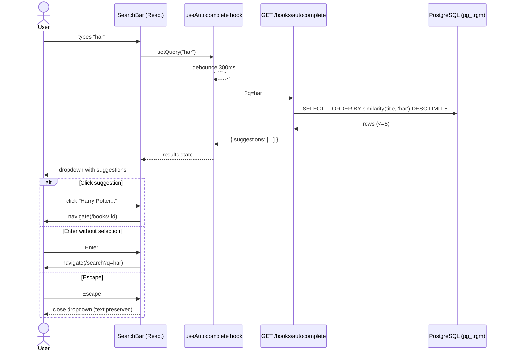

# Add typeahead/autocomplete to book search box

**Bead**: book-quiz-2p8 | **Status**: Requirements

## Description

Add typeahead and autocomplete functionality to the book search box on the landing page and any other search surfaces.

### Expected Behavior
- As user types in the search box, suggestions appear below (typeahead)
- Suggestions show matching book titles and authors
- Selecting a suggestion navigates to that book or fills the search
- Debounced API calls to avoid excessive requests
- Works for both desktop and mobile

### Context
- Existing `GET /api/v1/books` supports fuzzy search with query parameter
- Landing page (book-quiz-9y1) has search bar implemented
- Frontend: React + Tailwind CSS
- Backend: FastAPI with pg_trgm search
- DB has 1,200 books across grades 1-12

## Agent Log

| Date | Agent | Action | Summary |
|------|-------|--------|---------|
| 2026-08-03 | tech-lead | created | Issue filed, moved to requirements |

## Requirements Clarification

**Clarified by**: Product Manager | **Date**: 2026-08-03

### Problem Statement

Users currently must type a full query and press Enter to see any results. There is no real-time feedback while typing, leading to:
- **Uncertainty**: "Is this book even in the system?"
- **Wasted effort**: User types full title only to find zero results
- **Slow discovery**: No way to browse by partial input

### Target Audience
All users who search for books — the primary interaction on the landing page.

### User Stories

- **US-1**: As a reader, I want to see matching book suggestions as I type, so that I can quickly find my book without typing the full title.
- **US-2**: As a reader, I want to see the author name in suggestions, so that I can distinguish books with similar titles.
- **US-3**: As a reader, I want to click a suggestion to go directly to the book detail page, so that I can start a quiz immediately.
- **US-4**: As a reader on mobile, I want the suggestion dropdown to be touch-friendly and not obscure the keyboard, so that I can easily select a book.

### Decisions on Key Questions

| # | Question | Decision | Rationale |
|---|----------|----------|-----------|
| 1 | Endpoint for autocomplete? | **New dedicated endpoint**: `GET /api/v1/books/autocomplete?q=...` | Existing `/api/v1/books` runs a full COUNT query and returns pagination metadata — too heavy. New endpoint uses `LIMIT 5`, leverages pg_trgm `similarity()` ordering (DB already has `idx_books_title_trgm` GIN index), and returns a slim payload. |
| 2 | Data in suggestions? | **title + author + cover thumbnail + book id** | Title alone is ambiguous (many editions). Author disambiguates. Cover thumbnail aids visual recognition (already in Book model). ID is needed for navigation. |
| 3 | How many suggestions? | **5** | Standard for typeahead; balances utility with scanability. With 1,200 books, 5 is enough to capture the most relevant matches. |
| 4 | On-select behavior? | **Navigate directly to `/books/:id`** | User picking a specific book from a dropdown wants to see its detail page to start a quiz. Pressing Enter without selecting still triggers the existing search-results page flow. |
| 5 | Debounce timing? | **300ms** | Industry standard; balances responsiveness with server load. |
| 6 | "No results" state? | **Yes — show "No matching books found"** | Provides clear feedback instead of a confusing empty dropdown. |
| 7 | Accessibility? | **ARIA combobox pattern** (role="combobox", aria-expanded, aria-activedescendant, aria-autocomplete="list") + full keyboard navigation (arrow keys, Enter, Escape) | Required for screen-reader users and keyboard-only navigation. |

### Acceptance Criteria (Gherkin)

```gherkin
Feature: Book search autocomplete

  Scenario: Suggestions appear while typing
    Given I am on the landing page
    When I type "harry" in the search box and pause for 300ms
    Then I see up to 5 suggestions with title, author, and cover thumbnail
    And the suggestions are ordered by relevance

  Scenario: Minimum input length
    Given I am on the landing page
    When I type fewer than 2 characters in the search box
    Then no API call is made
    And no suggestion dropdown appears

  Scenario: Select a suggestion
    Given suggestions are visible for "harry potter"
    When I click the suggestion "Harry Potter and the Sorcerer's Stone"
    Then I am navigated to /books/{id} for that book

  Scenario: Keyboard navigation
    Given suggestions are visible for "harry"
    When I press ArrowDown twice and press Enter
    Then I am navigated to the book detail page for the 2nd suggestion

  Scenario: Escape closes suggestions
    Given suggestions are visible for "harry"
    When I press Escape
    Then the suggestion dropdown closes
    And the search box retains my typed text

  Scenario: No results
    Given I type "xyznonexistent" and pause for 300ms
    Then I see a message "No matching books found" in the dropdown

  Scenario: Press Enter without selecting
    Given suggestions are visible for "harry"
    When I do not highlight any suggestion and press Enter
    Then I am navigated to /search?q=harry (existing full search flow)

  Scenario: Both search surfaces (Landing + Header)
    Given I am on any page with the header search bar
    When I type in the header search bar
    Then autocomplete suggestions also appear there
    And on-select navigates to book detail

  Scenario: Loading state
    Given I type "harry" in the search box
    When the API call is in flight
    Then I see a subtle loading indicator at the bottom of the dropdown

  Scenario: API error handling
    Given the autocomplete API is unreachable
    When I type in the search box
    Then the dropdown silently fails (no suggestions shown)
    And my typing is not interrupted
```

### Autocomplete API Specification

```
GET /api/v1/books/autocomplete?q={query}

# Response 200
{
  "suggestions": [
    {
      "id": "uuid",
      "title": "Harry Potter and the Sorcerer's Stone",
      "author": "J.K. Rowling",
      "cover_url": "https://..."
    }
  ]
}
```

- Query parameter `q`: required, minimum 2 characters (return empty list if shorter)
- Response: array of up to 5 suggestions, ordered by `pg_trgm.similarity(title, query) DESC`
- No pagination, no count — this is a lightweight endpoint
- No authentication required
- Response time target: < 100ms p95

### Scope Boundaries

**In scope**:
- New `GET /api/v1/books/autocomplete` endpoint
- New `AutocompleteResponse` Pydantic schema
- Shared `<SearchBar />` component with autocomplete (used on both Landing and Header)
- Debounced input handling (300ms)
- Keyboard navigation (ArrowUp, ArrowDown, Enter, Escape)
- ARIA combobox accessibility
- "No results" empty state

**Out of scope** (for this issue):
- Replacing the existing full-search endpoint with pg_trgm (separate optimization)
- Caching autocomplete responses (premature for 1,200 book dataset)
- Fuzzy-correcting typos beyond what pg_trgm provides
- Search history or recent searches
- Highlighting matched text within suggestions (nice-to-have, separate PR)

### RICE Prioritization

| Factor | Score | Notes |
|--------|-------|-------|
| **Reach** | 8/10 | Every user touches search; it's the primary entry point |
| **Impact** | 7/10 | Significantly faster book discovery; reduces bounce |
| **Confidence** | 9/10 | Autocomplete is a proven, well-understood pattern |
| **Effort** | 5/10 | ~1 backend endpoint + ~1 shared frontend component |
| **RICE Score** | **100.8** | (8 × 7 × 9) / 5 |

### Risks

| Risk | Likelihood | Mitigation |
|------|-----------|------------|
| pg_trgm similarity() is slow without proper index | Low | `idx_books_title_trgm` GIN index already exists; `similarity()` can leverage it with a recheck. Verify with EXPLAIN ANALYZE. |
| Excessive API calls if debounce fails | Low | Debounce at 300ms; skip calls for < 2 chars |
| Dropdown overlaps mobile keyboard | Medium | Position dropdown above input on mobile with `bottom: 100%`; test on iOS Safari + Chrome Android |

---

**Status**: `status_requirements_clarified` — Ready for architecture review.

## Architecture Plan

### 1. Context & System Boundary

The current search path is synchronous: user types → Enter → full search → results page. There is zero feedback while typing. We are adding a real-time suggestion layer _on top_ of the existing search infrastructure without modifying the existing `GET /api/v1/books` endpoint.



### 2. Backend Design

#### 2.1 New Endpoint

**`GET /api/v1/books/autocomplete?q={query}`**

- **Router**: Registered on the existing `books` router (`app/api/books.py`) — no new router file needed.
- **Auth**: None (public). The autocomplete endpoint is placed _before_ `/{book_id}` to avoid route conflicts.
- **Query logic**:
  1. Trim and validate `q`. If `len(q.strip()) < 2`, return `{"suggestions": []}` immediately (no DB call).
  2. Use `sqlalchemy.func.similarity(Book.title, query)` for ordering. The existing `idx_books_title_trgm` GIN index on `books.title` with `gin_trgm_ops` supports this via index scan + recheck.
  3. `ORDER BY similarity DESC, title ASC` — secondary sort by title ensures deterministic tie-breaking.
  4. `LIMIT 5` — no offset, no count.
  5. Only select needed columns: `id, title, author, cover_url`.

#### 2.2 SQL (Logical)

```sql
SELECT id, title, author, cover_url
FROM books
WHERE similarity(title, :query) > 0
ORDER BY similarity(title, :query) DESC, title ASC
LIMIT 5;
```

The `WHERE similarity(...) > 0` clause filters out books with zero similarity (the function returns 0..1). For a 1,200-row table, the GIN index makes this a fast index scan.

#### 2.3 Schemas (Pydantic)

New in `app/schemas/book.py`:

```python
class AutocompleteSuggestion(BaseModel):
    """A single autocomplete suggestion — slim, no isbn/age_range/question_count."""
    id: str
    title: str
    author: str
    cover_url: str | None = None

    model_config = {"from_attributes": True}


class AutocompleteResponse(BaseModel):
    """Response for the autocomplete endpoint."""
    suggestions: list[AutocompleteSuggestion]
```

#### 2.4 Route Registration Order

In `app/api/books.py`, the autocomplete route MUST be defined _before_ `/{book_id}`:

```python
@router.get("/autocomplete", response_model=AutocompleteResponse)
def autocomplete_books(q: str = Query(..., min_length=1), db: Session = Depends(get_db)):
    ...

@router.get("/{book_id}", response_model=BookDetail)  # must come after /autocomplete
def get_book(book_id: str, ...):
    ...
```

### 3. Frontend Design

#### 3.1 Component Architecture

```
<SearchBar variant="hero" | "header" />
├── <input>                    # role="combobox", ARIA attrs wired
├── <SuggestionDropdown>       # conditionally rendered
│   ├── <SuggestionItem />*    # up to 5 items, keyboard-navigable
│   ├── <LoadingIndicator />   # spinner at dropdown bottom
│   ├── <EmptyState />         # "No matching books found"
│   └── (nothing)              # on error → silent close
└── (no dropdown)              # when q < 2 chars or no results yet
```

**Single shared component** — The same `<SearchBar />` is used in:
- **Landing page hero** (`variant="hero"`): large pill input, center-aligned
- **Layout header** (`variant="header"`): compact pill input, flex-aligned

A `variant` prop drives Tailwind class differences (padding, font-size, width).

#### 3.2 Custom Hooks

**`useDebounce(value, delay)`** — generic debounce hook:
- Returns the debounced value after `delay` ms of inactivity.
- Cleanup on unmount (clears timeout).
- 300ms as specified.

**`useAutocomplete(query: string)`** — encapsulates all autocomplete state:
- Calls `booksApi.autocomplete(debouncedQuery)` via React Query `useQuery`.
- `enabled: debouncedQuery.length >= 2`.
- Returns `{ suggestions, isLoading, isError, isOpen }`.
- `isOpen` derived: `true` when `debouncedQuery.length >= 2` AND (loading or results or empty). On error, `isOpen=false` (silent fail).

#### 3.3 Keyboard & ARIA (Combobox Pattern)

| Key | Behavior |
|-----|----------|
| **ArrowDown** | Move highlight down (wrap to top after last) |
| **ArrowUp** | Move highlight up (wrap to bottom after first) |
| **Enter** | If highlight index >= 0 → navigate to `/books/:id`. Else → navigate to `/search?q=...` (existing flow) |
| **Escape** | Close dropdown, preserve text, blur input |
| **Tab** | Close dropdown, move focus to next element |

ARIA attributes on `<input>`:
- `role="combobox"`
- `aria-expanded={isOpen}`
- `aria-autocomplete="list"`
- `aria-activedescendant={highlightedId}` — points to the `id` of the currently highlighted `<li>`
- `aria-controls="autocomplete-listbox"`

ARIA on `<ul>`:
- `role="listbox"`
- `id="autocomplete-listbox"`

Each `<li>`:
- `role="option"`
- `id="suggestion-{index}"`
- `aria-selected={index === highlightedIndex}`

#### 3.4 Edge Cases & State Transitions

| State | Trigger | UI |
|-------|---------|-----|
| **Idle** | `q.length < 2` | No dropdown, no API call |
| **Loading** | API call in flight | Dropdown open with 1 spinner row |
| **Results** | API returned 1–5 suggestions | Dropdown with suggestion items |
| **Empty** | API returned `[]` | Dropdown with "No matching books found" message |
| **Error** | Network/server error | Dropdown closes silently (don't block user), typing uninterrupted |
| **Stale** | New keystroke before old response | React Query cancels previous request; only latest rendered |
| **Blur** | User clicks outside | Close dropdown after 150ms delay (so click on suggestion registers first) |

Mobile positioning: Use `useRef` + `getBoundingClientRect()` to detect if the input is in the bottom half of the viewport. If so, position the dropdown _above_ the input (`bottom: 100%`). Otherwise, below (`top: 100%`).

#### 3.5 Frontend Type & API Client Additions

**`types/index.ts`** — add:
```typescript
export interface AutocompleteSuggestion {
  id: string;
  title: string;
  author: string;
  cover_url: string | null;
}

export interface AutocompleteResponse {
  suggestions: AutocompleteSuggestion[];
}
```

**`services/api.ts`** — add to `booksApi`:
```typescript
autocomplete: (q: string) =>
  api.get<AutocompleteResponse>('/api/v1/books/autocomplete', { params: { q } }),
```

### 4. File Change Manifest

| # | File | Change |
|---|------|--------|
| 1 | `backend/app/schemas/book.py` | Add `AutocompleteSuggestion`, `AutocompleteResponse` |
| 2 | `backend/app/api/books.py` | Add `/autocomplete` endpoint (before `/{book_id}`), import new schemas + `func` |
| 3 | `backend/tests/acceptance/test_book_search.py` | Add `TestBookAutocomplete` class: 6–8 test cases |
| 4 | `frontend/src/types/index.ts` | Add `AutocompleteSuggestion`, `AutocompleteResponse` |
| 5 | `frontend/src/services/api.ts` | Add `booksApi.autocomplete()` |
| 6 | `frontend/src/hooks/useDebounce.ts` | **NEW** — generic debounce hook (value, delay) |
| 7 | `frontend/src/hooks/useAutocomplete.ts` | **NEW** — fetches suggestions via React Query |
| 8 | `frontend/src/components/SearchBar.tsx` | **NEW** — shared combobox with dropdown, keyboard, ARIA |
| 9 | `frontend/src/pages/LandingPage.tsx` | Replace inline `<form>` with `<SearchBar variant="hero" />` |
| 10 | `frontend/src/components/Layout.tsx` | Replace inline `<form>` with `<SearchBar variant="header" />` |
| 11 | `frontend/src/components/Layout.test.tsx` | Update test for new SearchBar component presence |

### 5. Testing Strategy

**Backend (pytest, acceptance tests):**
- `test_autocomplete_returns_matching_suggestions` — basic happy path ("harry" → Harry Potter)
- `test_autocomplete_respects_limit_5` — seed 10 matching books, assert only 5 returned
- `test_autocomplete_short_query_returns_empty` — q="h" → `{suggestions: []}`
- `test_autocomplete_no_match_returns_empty` — q="zzzxxx" → `{suggestions: []}`
- `test_autocomplete_returns_cover_url` — verify cover_url field present
- `test_autocomplete_ordering_by_similarity` — "harry potter" should rank higher than "harry"-only match
- `test_autocomplete_no_auth_required` — no token → 200 OK
- `test_autocomplete_trims_whitespace` — q="  harry  " works

> **Note on SQLite**: `pg_trgm.similarity()` is PostgreSQL-specific and will **not** be available in the SQLite test database. The acceptance test fixture must either (a) be marked `@pytest.mark.skip` with a note to run against a real PG, or (b) we mock `func.similarity` in the test. Given the existing test suite uses SQLite, **option (a)** is pragmatic — the actual behavior is verified via EXPLAIN ANALYZE on staging.

**Frontend (Vitest + React Testing Library):**
- `SearchBar.test.tsx` — render with mock API, type input, assert dropdown appears with suggestions
- Keyboard navigation: ArrowDown/Up/Enter/Escape behavior
- Debounce: fast-type doesn't trigger multiple calls
- ARIA attributes present when dropdown is open
- `Layout.test.tsx` — update to verify `<SearchBar />` renders (replace old `getByLabelText('Search books')` with new label if changed)

### 6. ADR: Autocomplete Endpoint Design

- **Context**: Users need real-time suggestions while typing in the search box. Existing `/api/v1/books` is too heavy (full COUNT, pagination).
- **Decision**: New dedicated `GET /api/v1/books/autocomplete` endpoint using `pg_trgm.similarity()` with existing GIN index, returning max 5 slim suggestions.
- **Alternatives considered**:
  1. _Add a `?mode=autocomplete` param to existing `/books`_ — rejected; pollutes the existing endpoint contract, adds branching logic.
  2. _Client-side filtering of full book list_ — rejected; 1,200 books × full payload is too large for initial load; doesn't scale.
  3. _Use `word_similarity()` or `strict_word_similarity()` instead of `similarity()`_ — rejected; `similarity()` handles partial/substring matches better for typeahead where the user has typed only the beginning of a title.
- **Consequences**:
  - **Pros**: Lightweight (<100ms p95), zero auth overhead, reuses existing index, clean separation of concerns.
  - **Cons**: Requires PostgreSQL (can't run autocomplete acceptance tests on SQLite), adds ~6 new files to frontend.
  - **Migration**: None — additive change, existing `/books` endpoint untouched.

## Plan Review

**Reviewer**: Architecture Reviewer | **Date**: 2026-08-03
**Verdict**: **CONDITIONAL PASS** — 1 blocker (B1) must be addressed during implementation.

### Blockers

| # | Issue | Resolution |
|---|-------|------------|
| **B1** | Author search is absent from the similarity query. SQL only does `WHERE similarity(title, :query) > 0`. User story US-2 requires matching by author name. | Add `OR similarity(author, :query) > 0` to WHERE clause. Use `GREATEST(similarity(title, :query), similarity(author, :query))` in ORDER BY for composite ranking. |

### Other Findings

| # | Severity | Finding |
|---|----------|---------|
| S1 | HIGH | GIN trigram index does NOT accelerate `similarity()` in ORDER BY — forces seq scan. For 1,200 books this is fine (sub-ms). Correct plan's performance claim. |
| S2 | MEDIUM | No rate limiting on public autocomplete endpoint. Add 30 req/min per IP limit. |
| I1 | MEDIUM | `db.query(Book).with_entities()` returns Row objects, not ORM instances — `from_attributes` won't work. Use full Book query or manual dict construction. |
| I2 | MEDIUM | Header variant needs to suppress submit button (Layout header is bare input). Plan didn't explicitly address this. |
| I3 | LOW | LandingPage hero needs `autoFocus` — SearchBar should accept an `autoFocus` prop. |
| I4 | LOW | SQLite test gap acknowledged but no CI PostgreSQL coverage. Add mocked unit test as fallback. |
| R3 | MEDIUM | Use `onMouseDown` on suggestions instead of 150ms blur delay for click race condition. |
| R4 | MEDIUM | Wrap `useAutocomplete` return in `useMemo` to prevent unnecessary re-renders. |
| R5 | MEDIUM | Use `window.visualViewport` API instead of `getBoundingClientRect` for mobile keyboard awareness. |
| R6 | LOW | Add Playwright E2E test for autocomplete flow. |

### Architecture Alignment: ✅ PASS

All changes additive, no existing endpoints modified. Route ordering correctly identified. Component integration points validated against existing Landing and Layout pages. Follows existing patterns for React Query, Tailwind, and FastAPI routers.

## Implementation Notes

*Pending engineer delegation.*

## Code Review

*Pending code-reviewer delegation.*

## Security Audit

*Pending security-auditor delegation.*

## Test Results

*Pending tester delegation.*
