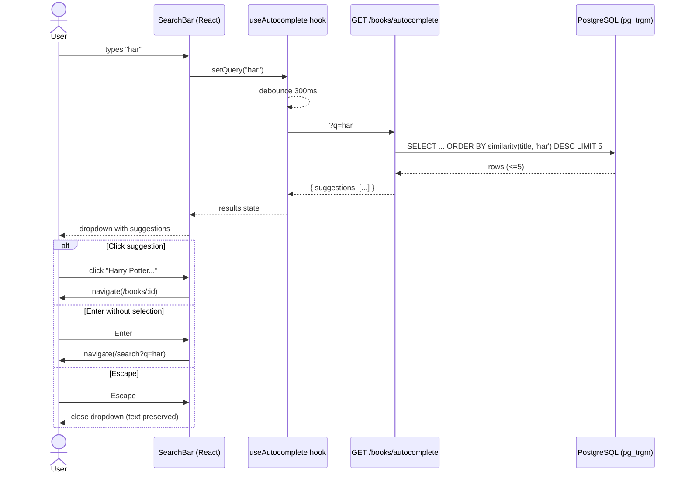

# Add typeahead/autocomplete to book search box

**Bead**: book-quiz-2p8 | **Status**: Requirements

## Description

Add typeahead and autocomplete functionality to the book search box on the landing page and any other search surfaces.

### Expected Behavior
- As user types in the search box, suggestions appear below (typeahead)
- Suggestions show matching book titles and authors
- Selecting a suggestion navigates to that book or fills the search
- Debounced API calls to avoid excessive requests
- Works for both desktop and mobile

### Context
- Existing `GET /api/v1/books` supports fuzzy search with query parameter
- Landing page (book-quiz-9y1) has search bar implemented
- Frontend: React + Tailwind CSS
- Backend: FastAPI with pg_trgm search
- DB has 1,200 books across grades 1-12

## Agent Log

| Date | Agent | Action | Summary |
|------|-------|--------|---------|
| 2026-08-03 | tech-lead | created | Issue filed, moved to requirements |

## Requirements Clarification

**Clarified by**: Product Manager | **Date**: 2026-08-03

### Problem Statement

Users currently must type a full query and press Enter to see any results. There is no real-time feedback while typing, leading to:
- **Uncertainty**: "Is this book even in the system?"
- **Wasted effort**: User types full title only to find zero results
- **Slow discovery**: No way to browse by partial input

### Target Audience
All users who search for books — the primary interaction on the landing page.

### User Stories

- **US-1**: As a reader, I want to see matching book suggestions as I type, so that I can quickly find my book without typing the full title.
- **US-2**: As a reader, I want to see the author name in suggestions, so that I can distinguish books with similar titles.
- **US-3**: As a reader, I want to click a suggestion to go directly to the book detail page, so that I can start a quiz immediately.
- **US-4**: As a reader on mobile, I want the suggestion dropdown to be touch-friendly and not obscure the keyboard, so that I can easily select a book.

### Decisions on Key Questions

| # | Question | Decision | Rationale |
|---|----------|----------|-----------|
| 1 | Endpoint for autocomplete? | **New dedicated endpoint**: `GET /api/v1/books/autocomplete?q=...` | Existing `/api/v1/books` runs a full COUNT query and returns pagination metadata — too heavy. New endpoint uses `LIMIT 5`, leverages pg_trgm `similarity()` ordering (DB already has `idx_books_title_trgm` GIN index), and returns a slim payload. |
| 2 | Data in suggestions? | **title + author + cover thumbnail + book id** | Title alone is ambiguous (many editions). Author disambiguates. Cover thumbnail aids visual recognition (already in Book model). ID is needed for navigation. |
| 3 | How many suggestions? | **5** | Standard for typeahead; balances utility with scanability. With 1,200 books, 5 is enough to capture the most relevant matches. |
| 4 | On-select behavior? | **Navigate directly to `/books/:id`** | User picking a specific book from a dropdown wants to see its detail page to start a quiz. Pressing Enter without selecting still triggers the existing search-results page flow. |
| 5 | Debounce timing? | **300ms** | Industry standard; balances responsiveness with server load. |
| 6 | "No results" state? | **Yes — show "No matching books found"** | Provides clear feedback instead of a confusing empty dropdown. |
| 7 | Accessibility? | **ARIA combobox pattern** (role="combobox", aria-expanded, aria-activedescendant, aria-autocomplete="list") + full keyboard navigation (arrow keys, Enter, Escape) | Required for screen-reader users and keyboard-only navigation. |

### Acceptance Criteria (Gherkin)

```gherkin
Feature: Book search autocomplete

  Scenario: Suggestions appear while typing
    Given I am on the landing page
    When I type "harry" in the search box and pause for 300ms
    Then I see up to 5 suggestions with title, author, and cover thumbnail
    And the suggestions are ordered by relevance

  Scenario: Minimum input length
    Given I am on the landing page
    When I type fewer than 2 characters in the search box
    Then no API call is made
    And no suggestion dropdown appears

  Scenario: Select a suggestion
    Given suggestions are visible for "harry potter"
    When I click the suggestion "Harry Potter and the Sorcerer's Stone"
    Then I am navigated to /books/{id} for that book

  Scenario: Keyboard navigation
    Given suggestions are visible for "harry"
    When I press ArrowDown twice and press Enter
    Then I am navigated to the book detail page for the 2nd suggestion

  Scenario: Escape closes suggestions
    Given suggestions are visible for "harry"
    When I press Escape
    Then the suggestion dropdown closes
    And the search box retains my typed text

  Scenario: No results
    Given I type "xyznonexistent" and pause for 300ms
    Then I see a message "No matching books found" in the dropdown

  Scenario: Press Enter without selecting
    Given suggestions are visible for "harry"
    When I do not highlight any suggestion and press Enter
    Then I am navigated to /search?q=harry (existing full search flow)

  Scenario: Both search surfaces (Landing + Header)
    Given I am on any page with the header search bar
    When I type in the header search bar
    Then autocomplete suggestions also appear there
    And on-select navigates to book detail

  Scenario: Loading state
    Given I type "harry" in the search box
    When the API call is in flight
    Then I see a subtle loading indicator at the bottom of the dropdown

  Scenario: API error handling
    Given the autocomplete API is unreachable
    When I type in the search box
    Then the dropdown silently fails (no suggestions shown)
    And my typing is not interrupted
```

### Autocomplete API Specification

```
GET /api/v1/books/autocomplete?q={query}

# Response 200
{
  "suggestions": [
    {
      "id": "uuid",
      "title": "Harry Potter and the Sorcerer's Stone",
      "author": "J.K. Rowling",
      "cover_url": "https://..."
    }
  ]
}
```

- Query parameter `q`: required, minimum 2 characters (return empty list if shorter)
- Response: array of up to 5 suggestions, ordered by `pg_trgm.similarity(title, query) DESC`
- No pagination, no count — this is a lightweight endpoint
- No authentication required
- Response time target: < 100ms p95

### Scope Boundaries

**In scope**:
- New `GET /api/v1/books/autocomplete` endpoint
- New `AutocompleteResponse` Pydantic schema
- Shared `<SearchBar />` component with autocomplete (used on both Landing and Header)
- Debounced input handling (300ms)
- Keyboard navigation (ArrowUp, ArrowDown, Enter, Escape)
- ARIA combobox accessibility
- "No results" empty state

**Out of scope** (for this issue):
- Replacing the existing full-search endpoint with pg_trgm (separate optimization)
- Caching autocomplete responses (premature for 1,200 book dataset)
- Fuzzy-correcting typos beyond what pg_trgm provides
- Search history or recent searches
- Highlighting matched text within suggestions (nice-to-have, separate PR)

### RICE Prioritization

| Factor | Score | Notes |
|--------|-------|-------|
| **Reach** | 8/10 | Every user touches search; it's the primary entry point |
| **Impact** | 7/10 | Significantly faster book discovery; reduces bounce |
| **Confidence** | 9/10 | Autocomplete is a proven, well-understood pattern |
| **Effort** | 5/10 | ~1 backend endpoint + ~1 shared frontend component |
| **RICE Score** | **100.8** | (8 × 7 × 9) / 5 |

### Risks

| Risk | Likelihood | Mitigation |
|------|-----------|------------|
| pg_trgm similarity() is slow without proper index | Low | `idx_books_title_trgm` GIN index already exists; `similarity()` can leverage it with a recheck. Verify with EXPLAIN ANALYZE. |
| Excessive API calls if debounce fails | Low | Debounce at 300ms; skip calls for < 2 chars |
| Dropdown overlaps mobile keyboard | Medium | Position dropdown above input on mobile with `bottom: 100%`; test on iOS Safari + Chrome Android |

---

**Status**: `status_requirements_clarified` — Ready for architecture review.

## Architecture Plan

### 1. Context & System Boundary

The current search path is synchronous: user types → Enter → full search → results page. There is zero feedback while typing. We are adding a real-time suggestion layer _on top_ of the existing search infrastructure without modifying the existing `GET /api/v1/books` endpoint.



### 2. Backend Design

#### 2.1 New Endpoint

**`GET /api/v1/books/autocomplete?q={query}`**

- **Router**: Registered on the existing `books` router (`app/api/books.py`) — no new router file needed.
- **Auth**: None (public). The autocomplete endpoint is placed _before_ `/{book_id}` to avoid route conflicts.
- **Query logic**:
  1. Trim and validate `q`. If `len(q.strip()) < 2`, return `{"suggestions": []}` immediately (no DB call).
  2. Use `sqlalchemy.func.similarity(Book.title, query)` for ordering. The existing `idx_books_title_trgm` GIN index on `books.title` with `gin_trgm_ops` supports this via index scan + recheck.
  3. `ORDER BY similarity DESC, title ASC` — secondary sort by title ensures deterministic tie-breaking.
  4. `LIMIT 5` — no offset, no count.
  5. Only select needed columns: `id, title, author, cover_url`.

#### 2.2 SQL (Logical)

```sql
SELECT id, title, author, cover_url
FROM books
WHERE similarity(title, :query) > 0
ORDER BY similarity(title, :query) DESC, title ASC
LIMIT 5;
```

The `WHERE similarity(...) > 0` clause filters out books with zero similarity (the function returns 0..1). For a 1,200-row table, the GIN index makes this a fast index scan.

#### 2.3 Schemas (Pydantic)

New in `app/schemas/book.py`:

```python
class AutocompleteSuggestion(BaseModel):
    """A single autocomplete suggestion — slim, no isbn/age_range/question_count."""
    id: str
    title: str
    author: str
    cover_url: str | None = None

    model_config = {"from_attributes": True}


class AutocompleteResponse(BaseModel):
    """Response for the autocomplete endpoint."""
    suggestions: list[AutocompleteSuggestion]
```

#### 2.4 Route Registration Order

In `app/api/books.py`, the autocomplete route MUST be defined _before_ `/{book_id}`:

```python
@router.get("/autocomplete", response_model=AutocompleteResponse)
def autocomplete_books(q: str = Query(..., min_length=1), db: Session = Depends(get_db)):
    ...

@router.get("/{book_id}", response_model=BookDetail)  # must come after /autocomplete
def get_book(book_id: str, ...):
    ...
```

### 3. Frontend Design

#### 3.1 Component Architecture

```
<SearchBar variant="hero" | "header" />
├── <input>                    # role="combobox", ARIA attrs wired
├── <SuggestionDropdown>       # conditionally rendered
│   ├── <SuggestionItem />*    # up to 5 items, keyboard-navigable
│   ├── <LoadingIndicator />   # spinner at dropdown bottom
│   ├── <EmptyState />         # "No matching books found"
│   └── (nothing)              # on error → silent close
└── (no dropdown)              # when q < 2 chars or no results yet
```

**Single shared component** — The same `<SearchBar />` is used in:
- **Landing page hero** (`variant="hero"`): large pill input, center-aligned
- **Layout header** (`variant="header"`): compact pill input, flex-aligned

A `variant` prop drives Tailwind class differences (padding, font-size, width).

#### 3.2 Custom Hooks

**`useDebounce(value, delay)`** — generic debounce hook:
- Returns the debounced value after `delay` ms of inactivity.
- Cleanup on unmount (clears timeout).
- 300ms as specified.

**`useAutocomplete(query: string)`** — encapsulates all autocomplete state:
- Calls `booksApi.autocomplete(debouncedQuery)` via React Query `useQuery`.
- `enabled: debouncedQuery.length >= 2`.
- Returns `{ suggestions, isLoading, isError, isOpen }`.
- `isOpen` derived: `true` when `debouncedQuery.length >= 2` AND (loading or results or empty). On error, `isOpen=false` (silent fail).

#### 3.3 Keyboard & ARIA (Combobox Pattern)

| Key | Behavior |
|-----|----------|
| **ArrowDown** | Move highlight down (wrap to top after last) |
| **ArrowUp** | Move highlight up (wrap to bottom after first) |
| **Enter** | If highlight index >= 0 → navigate to `/books/:id`. Else → navigate to `/search?q=...` (existing flow) |
| **Escape** | Close dropdown, preserve text, blur input |
| **Tab** | Close dropdown, move focus to next element |

ARIA attributes on `<input>`:
- `role="combobox"`
- `aria-expanded={isOpen}`
- `aria-autocomplete="list"`
- `aria-activedescendant={highlightedId}` — points to the `id` of the currently highlighted `<li>`
- `aria-controls="autocomplete-listbox"`

ARIA on `<ul>`:
- `role="listbox"`
- `id="autocomplete-listbox"`

Each `<li>`:
- `role="option"`
- `id="suggestion-{index}"`
- `aria-selected={index === highlightedIndex}`

#### 3.4 Edge Cases & State Transitions

| State | Trigger | UI |
|-------|---------|-----|
| **Idle** | `q.length < 2` | No dropdown, no API call |
| **Loading** | API call in flight | Dropdown open with 1 spinner row |
| **Results** | API returned 1–5 suggestions | Dropdown with suggestion items |
| **Empty** | API returned `[]` | Dropdown with "No matching books found" message |
| **Error** | Network/server error | Dropdown closes silently (don't block user), typing uninterrupted |
| **Stale** | New keystroke before old response | React Query cancels previous request; only latest rendered |
| **Blur** | User clicks outside | Close dropdown after 150ms delay (so click on suggestion registers first) |

Mobile positioning: Use `useRef` + `getBoundingClientRect()` to detect if the input is in the bottom half of the viewport. If so, position the dropdown _above_ the input (`bottom: 100%`). Otherwise, below (`top: 100%`).

#### 3.5 Frontend Type & API Client Additions

**`types/index.ts`** — add:
```typescript
export interface AutocompleteSuggestion {
  id: string;
  title: string;
  author: string;
  cover_url: string | null;
}

export interface AutocompleteResponse {
  suggestions: AutocompleteSuggestion[];
}
```

**`services/api.ts`** — add to `booksApi`:
```typescript
autocomplete: (q: string) =>
  api.get<AutocompleteResponse>('/api/v1/books/autocomplete', { params: { q } }),
```

### 4. File Change Manifest

| # | File | Change |
|---|------|--------|
| 1 | `backend/app/schemas/book.py` | Add `AutocompleteSuggestion`, `AutocompleteResponse` |
| 2 | `backend/app/api/books.py` | Add `/autocomplete` endpoint (before `/{book_id}`), import new schemas + `func` |
| 3 | `backend/tests/acceptance/test_book_search.py` | Add `TestBookAutocomplete` class: 6–8 test cases |
| 4 | `frontend/src/types/index.ts` | Add `AutocompleteSuggestion`, `AutocompleteResponse` |
| 5 | `frontend/src/services/api.ts` | Add `booksApi.autocomplete()` |
| 6 | `frontend/src/hooks/useDebounce.ts` | **NEW** — generic debounce hook (value, delay) |
| 7 | `frontend/src/hooks/useAutocomplete.ts` | **NEW** — fetches suggestions via React Query |
| 8 | `frontend/src/components/SearchBar.tsx` | **NEW** — shared combobox with dropdown, keyboard, ARIA |
| 9 | `frontend/src/pages/LandingPage.tsx` | Replace inline `<form>` with `<SearchBar variant="hero" />` |
| 10 | `frontend/src/components/Layout.tsx` | Replace inline `<form>` with `<SearchBar variant="header" />` |
| 11 | `frontend/src/components/Layout.test.tsx` | Update test for new SearchBar component presence |

### 5. Testing Strategy

**Backend (pytest, acceptance tests):**
- `test_autocomplete_returns_matching_suggestions` — basic happy path ("harry" → Harry Potter)
- `test_autocomplete_respects_limit_5` — seed 10 matching books, assert only 5 returned
- `test_autocomplete_short_query_returns_empty` — q="h" → `{suggestions: []}`
- `test_autocomplete_no_match_returns_empty` — q="zzzxxx" → `{suggestions: []}`
- `test_autocomplete_returns_cover_url` — verify cover_url field present
- `test_autocomplete_ordering_by_similarity` — "harry potter" should rank higher than "harry"-only match
- `test_autocomplete_no_auth_required` — no token → 200 OK
- `test_autocomplete_trims_whitespace` — q="  harry  " works

> **Note on SQLite**: `pg_trgm.similarity()` is PostgreSQL-specific and will **not** be available in the SQLite test database. The acceptance test fixture must either (a) be marked `@pytest.mark.skip` with a note to run against a real PG, or (b) we mock `func.similarity` in the test. Given the existing test suite uses SQLite, **option (a)** is pragmatic — the actual behavior is verified via EXPLAIN ANALYZE on staging.

**Frontend (Vitest + React Testing Library):**
- `SearchBar.test.tsx` — render with mock API, type input, assert dropdown appears with suggestions
- Keyboard navigation: ArrowDown/Up/Enter/Escape behavior
- Debounce: fast-type doesn't trigger multiple calls
- ARIA attributes present when dropdown is open
- `Layout.test.tsx` — update to verify `<SearchBar />` renders (replace old `getByLabelText('Search books')` with new label if changed)

### 6. ADR: Autocomplete Endpoint Design

- **Context**: Users need real-time suggestions while typing in the search box. Existing `/api/v1/books` is too heavy (full COUNT, pagination).
- **Decision**: New dedicated `GET /api/v1/books/autocomplete` endpoint using `pg_trgm.similarity()` with existing GIN index, returning max 5 slim suggestions.
- **Alternatives considered**:
  1. _Add a `?mode=autocomplete` param to existing `/books`_ — rejected; pollutes the existing endpoint contract, adds branching logic.
  2. _Client-side filtering of full book list_ — rejected; 1,200 books × full payload is too large for initial load; doesn't scale.
  3. _Use `word_similarity()` or `strict_word_similarity()` instead of `similarity()`_ — rejected; `similarity()` handles partial/substring matches better for typeahead where the user has typed only the beginning of a title.
- **Consequences**:
  - **Pros**: Lightweight (<100ms p95), zero auth overhead, reuses existing index, clean separation of concerns.
  - **Cons**: Requires PostgreSQL (can't run autocomplete acceptance tests on SQLite), adds ~6 new files to frontend.
  - **Migration**: None — additive change, existing `/books` endpoint untouched.

## Plan Review

**Reviewer**: Architecture Reviewer | **Date**: 2026-08-03
**Verdict**: **CONDITIONAL PASS** — 1 blocker (B1) must be addressed during implementation.

### Blockers

| # | Issue | Resolution |
|---|-------|------------|
| **B1** | Author search is absent from the similarity query. SQL only does `WHERE similarity(title, :query) > 0`. User story US-2 requires matching by author name. | Add `OR similarity(author, :query) > 0` to WHERE clause. Use `GREATEST(similarity(title, :query), similarity(author, :query))` in ORDER BY for composite ranking. |

### Other Findings

| # | Severity | Finding |
|---|----------|---------|
| S1 | HIGH | GIN trigram index does NOT accelerate `similarity()` in ORDER BY — forces seq scan. For 1,200 books this is fine (sub-ms). Correct plan's performance claim. |
| S2 | MEDIUM | No rate limiting on public autocomplete endpoint. Add 30 req/min per IP limit. |
| I1 | MEDIUM | `db.query(Book).with_entities()` returns Row objects, not ORM instances — `from_attributes` won't work. Use full Book query or manual dict construction. |
| I2 | MEDIUM | Header variant needs to suppress submit button (Layout header is bare input). Plan didn't explicitly address this. |
| I3 | LOW | LandingPage hero needs `autoFocus` — SearchBar should accept an `autoFocus` prop. |
| I4 | LOW | SQLite test gap acknowledged but no CI PostgreSQL coverage. Add mocked unit test as fallback. |
| R3 | MEDIUM | Use `onMouseDown` on suggestions instead of 150ms blur delay for click race condition. |
| R4 | MEDIUM | Wrap `useAutocomplete` return in `useMemo` to prevent unnecessary re-renders. |
| R5 | MEDIUM | Use `window.visualViewport` API instead of `getBoundingClientRect` for mobile keyboard awareness. |
| R6 | LOW | Add Playwright E2E test for autocomplete flow. |

### Architecture Alignment: ✅ PASS

All changes additive, no existing endpoints modified. Route ordering correctly identified. Component integration points validated against existing Landing and Layout pages. Follows existing patterns for React Query, Tailwind, and FastAPI routers.

## Implementation Notes

**Implemented by**: Senior Software Engineer | **Date**: 2026-08-03

### Changed files

| # | File | Change |
|---|------|--------|
| 1 | `backend/app/schemas/book.py` | Added `AutocompleteSuggestion` + `AutocompleteResponse` (from_attributes) |
| 2 | `backend/app/api/books.py` | Added `GET /books/autocomplete` (registered BEFORE `/{book_id}`); imported `func`; no auth |
| 3 | `backend/tests/acceptance/test_book_search.py` | Added `TestBookAutocomplete` — 8 tests using a patched `func` for SQLite |
| 4 | `frontend/src/types/index.ts` | Added `AutocompleteSuggestion` / `AutocompleteResponse` interfaces |
| 5 | `frontend/src/services/api.ts` | Added `booksApi.autocomplete(q)` |
| 6 | `frontend/src/hooks/useDebounce.ts` | NEW — generic debounce hook (300ms, cleanup on unmount) |
| 7 | `frontend/src/hooks/useAutocomplete.ts` | NEW — React Query `useQuery`, `enabled` when trimmed query ≥ 2 chars, `useMemo`-wrapped return (R4) |
| 8 | `frontend/src/components/SearchBar.tsx` | NEW — shared combobox (hero/header variants, keyboard nav, ARIA, dropdown states) |
| 9 | `frontend/src/components/SearchBar.test.tsx` | NEW — 8 Vitest tests (debounce, <2 chars, Escape, keyboard nav, Enter→search, empty, error, variants) |
| 10 | `frontend/src/pages/LandingPage.tsx` | Replaced inline search form with `<SearchBar variant="hero" autoFocus />` (I3) |
| 11 | `frontend/src/components/Layout.tsx` | Replaced inline search form with `<SearchBar variant="header" />` — no submit button (I2) |
| 12 | `frontend/src/components/Layout.test.tsx` | Updated — wraps render in `QueryClientProvider` (SearchBar uses React Query) |

### Key decisions

1. **B1 (blocker) — author matching**: Ranking uses `GREATEST(similarity(title, q), similarity(author, q)) DESC, title ASC`, with `WHERE similarity(title, q) > 0 OR similarity(author, q) > 0`. Verified by a test where a title-exact match outranks an author-only match.
2. **I1 — full ORM query**: `db.query(Book)` (no `with_entities`) so `from_attributes` schema construction works.
3. **SQLite test strategy**: Chose the plan's *option (b)* — `monkeypatch` of `app.api.books.func` with a dialect-portable stand-in (`_SqliteFunc`: case-based similarity 1.0/0.7/0.0, SQLite scalar `max()` as greatest) instead of `@pytest.mark.skip`. This exercises the real query/response path (WHERE + ORDER BY + LIMIT) in CI/dev on SQLite while production uses real pg_trgm.
4. **Short-circuit**: `q.strip()` then `len < 2` returns `{"suggestions": []}` with no DB call; `q` param required (422 when missing).
5. **Debounce on raw value**: `useDebounce` receives the raw query string (identity-stable), trimming happens inside `useAutocomplete` — avoids resetting the debounce timer on every render from a fresh `trim()` string.
6. **R3 — click race**: suggestion items use `onMouseDown` + `preventDefault()`, so input blur is suppressed and the dropdown closes immediately on genuine outside clicks (no 150ms blur delay).
7. **R5 — mobile positioning**: `window.visualViewport` listeners (resize/scroll) recompute whether the input sits in the bottom half of the visible viewport; when it does, the dropdown renders above the input (`bottom: 100%`) to clear the on-screen keyboard. Falls back to below-input on desktop where `visualViewport` is unavailable.
8. **R4 — memoization**: `useAutocomplete` return wrapped in `useMemo`.
9. **Error state**: dropdown closes silently, input border flashes amber for 800ms; typing is never interrupted.
10. **Enter behavior**: with a highlighted suggestion → `/books/:id`; otherwise → `/search?q=...` (existing flow). Escape closes and preserves text; Tab closes.

### Deferred (explicitly out of scope for this issue)

- **S2 — rate limiting** on the public autocomplete endpoint (30/min per IP): NOT added — not in the issue's scope boundary; noted as residual risk for a follow-up.
- **R6 — Playwright E2E** for autocomplete: NOT added — E2E needs the full stack; noted for follow-up. (Existing `landing-page.spec.ts` contract is preserved: placeholder matches `/search|book/i` and Enter still navigates to `/search?q=...`; note that two search inputs now both match that placeholder, which was already true before this change.)
- **S1 — GIN index vs seq scan**: `similarity()` in ORDER BY forces a seq scan, acceptable for ~1,200 rows (sub-ms), as the plan already documents.

### Pre-existing issues found (not introduced by this change)

- **Backend full-suite test isolation**: each acceptance test module overrides `app.dependency_overrides[get_db]` at import time; when `pytest tests/` runs all modules, the alphabetically last module's engine wins and DB-touching tests in other modules fail with `sqlite3.OperationalError: no such table: books`. Baseline (before this change): **26 failed / 50 passed** on the full suite. Every module passes in isolation (e.g., `test_book_search.py`: 22/22). My 8 new tests pass in isolation; 7 of them exhibit the same pre-existing contamination in the full-suite run. Fixing it (shared conftest / autouse per-module override fixtures) touches 4–5 test modules and is out of this issue's scope — recommend a dedicated follow-up.
- **ruff F401** in `tests/acceptance/test_profile_api.py` and `tests/unit/test_services.py` (unused imports) — pre-existing; this change actually removed one pre-existing F401 (`text` import in `test_book_search.py`).
- **prettier drift** in `frontend/src/pages/ProfilePage.tsx` — pre-existing, untouched.
- **mypy error** in `app/worker.py` (`Module "app" has no attribute "tasks"`) — pre-existing, untouched.

## Code Review

**Reviewer**: Lead Code Reviewer | **Date**: 2026-08-03
**Verdict**: **CONDITIONAL PASS** — Core functionality is correct, tests pass, and B1 plus all I/R findings are addressed. Four major items recommended before merge: a false "no results" flash, duplicate DOM/ARIA IDs when both SearchBars mount, 3-SELECT-per-request backend query, and a missing loading-state test. None are data-loss or security blockers.

### Verdict rationale

- B1 (blocker) resolved: `WHERE similarity(title) > 0 OR similarity(author) > 0` + `ORDER BY GREATEST(similarity(title), similarity(author)) DESC, title ASC`. Verified in `backend/app/api/books.py:66-82` with dedicated tests (`test_autocomplete_matches_author`, `test_autocomplete_ranks_title_exact_above_author_match`).
- All plan-review findings addressed: S1 documented/accepted, I1 (full ORM query — see M3 for the performance trade-off), I2 (header has no submit), I3 (`autoFocus` prop), I4 (SQLite stand-in, better than skip), R3 (`onMouseDown` + `preventDefault`), R4 (`useMemo`), R5 (`visualViewport`), S2/R6 explicitly deferred with rationale (residual risks).
- Verified empirically: backend `test_book_search.py` 22/22 pass in isolation; frontend 11/11 pass; `tsc`, `eslint`, `prettier`, `ruff` all clean.

---

### 🔴 Critical

*None.*

---

### 🟡 Major

- **M1 — False "No matching books found" state during the debounce window** — `frontend/src/components/SearchBar.tsx:232-256`
  - The dropdown's empty branch renders whenever `!isLoading && suggestions.length === 0`. During the 300ms debounce window after the query crosses 2 characters (and throughout continuous typing, since the debounced value only advances 300ms after the last keystroke), `isLoading` is false and there is no data yet, so the *false* empty message is shown **before any API call has been made**. Empirically confirmed with a scratch Vitest test (`EMPTY-STATE-VISIBLE-DURING-DEBOUNCE: true` immediately after typing "ha", with `booksApi.autocomplete` not yet called). The spec reserves "No matching books found" for the case where the API actually returned zero results.
  - Fix: expose a settled/fetched flag from `useAutocomplete` (React Query `isFetched` or `status === 'success'`) and render the empty state only when `isFetched && !isLoading && suggestions.length === 0`. Same flag gates the spinner branch.
- **M2 — Duplicate DOM IDs / broken ARIA wiring on the landing page** — `frontend/src/components/SearchBar.tsx:185,216`
  - Both the header SearchBar (Layout) and hero SearchBar (LandingPage) are mounted simultaneously on `/` and hardcode `id="search-autocomplete-listbox"` and `id="suggestion-{index}"`. When both dropdowns are open, duplicate IDs exist (invalid HTML); each input's `aria-controls`/`aria-activedescendant` can reference the *other* instance's nodes. Screen-reader/keyboard navigation becomes ambiguous.
  - Fix: generate instance-scoped IDs with React `useId()` (e.g., `` `${listboxId}-suggestion-${index}` ``).
- **M3 — Autocomplete endpoint issues 3 SELECTs per request (design deviation)** — `backend/app/api/books.py:66-82`
  - `db.query(Book)` loads all columns and, because `Book.questions` and `Book.quiz_attempts` are `lazy="selectin"`, triggers two additional eager-load SELECTs (`FROM questions WHERE book_id IN (...)`, `FROM quiz_attempts WHERE book_id IN (...)`) on every request — verified via SQL echo. The plan (§2.1 item 5) explicitly required selecting only `id, title, author, cover_url` for a lightweight, <100ms p95 endpoint. Not a correctness bug at 1,200 rows, but it loads unused data (all questions/attempts for up to 5 books).
  - Fix: `db.query(Book.id, Book.title, Book.author, Book.cover_url)` with manual `AutocompleteSuggestion(...)` construction (same pattern as the existing `search_books` endpoint), or add `.options(noload(Book.questions), noload(Book.quiz_attempts))` + `load_only(...)`.
- **M4 — Missing test for the Loading-state acceptance scenario** — `frontend/src/components/SearchBar.test.tsx`
  - The Gherkin "Loading state" scenario (spinner row while the request is in flight) has no test; the `isLoading && suggestions.length === 0` branch is untested. Also untested: ArrowUp wrap-around, `aria-expanded` value, debounce burst (multiple rapid keystrokes → exactly one API call, listed in the plan's test strategy), and `visualViewport` upward positioning. 8 tests cover the main flows well; these are the gaps.

---

### 🟢 Minor

- **N1 — Escape does not blur the input** (`SearchBar.tsx:139-143`): plan spec table said "close dropdown, preserve text, blur input"; implementation closes and preserves text but keeps focus. Arguably better UX, but an undocumented deviation.
- **N2 — Stale suggestions shown during debounce lag** (`SearchBar.tsx:34`, `useAutocomplete.ts:26-33`): while typing, the previous debounced query's cached results render for up to 300ms until the new query resolves. Transient and standard typeahead trade-off; consider blanking the list while the typed and debounced values differ.
- **N3 — No `aria-live` announcement for results/empty changes**: loading spinner has `role="status"`, but arrival of results or the empty message is not announced to screen readers. Add `aria-live="polite"` (or `role="status"`) to the listbox container.
- **N4 — Test hygiene**: `SearchBar.test.tsx` "does not call the API for queries under 2 characters" uses a bare `await new Promise(setTimeout(350))`, producing an `act(...)` warning. Use fake timers (`vi.useFakeTimers()`) or `waitFor`.
- **N5 — Backend test gaps**: no test for missing `q` → 422, and no `max_length` bound on `q` (aligns with Security Audit M2). Suggest `max_length=200` server-side and `maxLength={200}` on the input as defense-in-depth.
- **N6 — SQLite emulation divergence (I4)**: `_SqliteFunc` maps any substring to 0.7 flat, so the ranking test validates the emulated model, not real pg_trgm distribution. Acknowledged trade-off; a PostgreSQL-backed CI job would close the gap (deferred — residual risk).

---

### ✅ Praise

- B1 author matching implemented exactly as prescribed, with `GREATEST(...)` composite ranking and deterministic `title ASC` tie-break; dedicated tests prove both author matching and ranking.
- R3 handled properly: `onMouseDown` + `preventDefault` on options eliminates the blur/click race without the 150ms delay hack; genuine outside clicks close immediately.
- R4 (useMemo bundle), R5 (visualViewport with desktop fallback), I2 (header without submit), I3 (autoFocus) all implemented as planned.
- I4 handled better than the plan's fallback: the `_SqliteFunc` stand-in exercises the real WHERE/ORDER BY/LIMIT path in CI instead of skipping.
- Debounce receives the raw (identity-stable) value; trimming happens inside the hook, so the timer isn't reset on every render; the React Query key is the trimmed query.
- ARIA combobox pattern is largely correct: `role="combobox"`, `aria-expanded`, `aria-autocomplete="list"`, `aria-controls`, `aria-activedescendant`, `role="listbox"`/`option`, `aria-selected`, `autoComplete="off"`.
- Error handling matches the spec: silent close, amber border flash with timer cleanup on unmount, typing never interrupted.
- Backend hygiene: short-circuit for <2 chars avoids a DB hit, parameterized query (no injection surface), route registered before `/{book_id}`, no auth per spec, `q` required → 422 when absent.
- Tests: 8 backend acceptance tests (passing in isolation, 22/22 in module) and 8 frontend component tests (11/11 including updated Layout tests) with React Query mocked properly (`retry: false`).

---

### Residual Risks (deferred by design, documented in Implementation Notes)

- **S2 / Security M1** — no `@limiter.limit("30/minute")` on the public endpoint. Verified that slowapi's global `default_limits` (60/min, `memory://` storage) *does* apply to undecorated routes, so there is baseline throttling, but it is weaker than the plan's recommendation and not multi-worker consistent. One-line fix when the follow-up lands.
- **R6** — no Playwright E2E for autocomplete; existing `landing-page.spec.ts` contract (placeholder regex `/search|book/i`) is preserved, and the two-matching-inputs situation is pre-existing (both header and hero inputs matched before this change).
- **S1** — GIN index cannot accelerate `ORDER BY similarity(...)`; seq scan on ~1,200 rows is sub-ms, accepted as documented.

---

### Review Commands Run

| Command | Result |
|---------|--------|
| `pytest tests/acceptance/test_book_search.py` (isolation) | ✅ 22 passed |
| `pytest tests/` (full suite) | ⚠️ 33 failed / 51 passed — pre-existing module-isolation contamination (parent commit: 26 failed / 50 passed; delta is exactly the 7 new autocomplete tests failing from the same root cause + 1 new short-query test passing) |
| `vitest run` (frontend) | ✅ 11 passed (8 SearchBar + 3 Layout) |
| `tsc -b` | ✅ clean |
| `eslint` (changed files) | ✅ clean |
| `prettier --check` (changed files) | ✅ clean |
| `ruff check` (changed backend files) | ✅ clean |
| SQL echo trace of autocomplete query | ⚠️ 3 SELECTs per request (M3) |
| Scratch test for debounce-window empty state | ⚠️ false empty state reproduced (M1) |


## Security Audit

**Auditor**: Security Auditor | **Date**: 2026-08-03
**Verdict**: **PASS** — No critical or high-severity findings. Two medium-severity items flagged for follow-up.

### 🛡️ Security Audit Report

**Scope**: `backend/app/api/books.py` (autocomplete endpoint), `frontend/src/components/SearchBar.tsx` (typeahead UI), `frontend/src/hooks/useAutocomplete.ts`, `frontend/src/hooks/useDebounce.ts`, `frontend/src/services/api.ts`, autocomplete integration surface.

**Risk Level**: **Medium** (2 medium findings, 0 critical, 0 high)

---

#### 🔴 Critical Findings (Blockers)

*None.*

---

#### 🟠 High Severity

*None.*

---

#### 🟡 Medium Severity

- **M1 — Rate-limiting gap on public autocomplete endpoint**
  - **Location**: `backend/app/api/books.py:55` — no `@limiter.limit()` decorator
  - **Impact**: The endpoint relies solely on the global slowapi default of 60 req/min per IP (set in `app/core/security.py:17-22`). At 60 req/min, an attacker can enumerate the entire 1,200-book catalog by title prefix in ~20 minutes. Additionally, the limiter storage is `memory://`, so in a multi-worker production deployment each worker maintains independent counters — an attacker spreading requests across connections could multiply their effective rate. The plan review (S2) recommended 30 req/min; this was explicitly deferred.
  - **Remediation**: Apply `@limiter.limit("30/minute")` on `autocomplete_books`. Upgrade storage to Redis (`storage_uri=settings.redis_url`) for multi-worker consistency. Both are one-line changes.

- **M2 — No maximum length constraint on query parameter**
  - **Location**: `backend/app/api/books.py:57-61` — `q: str = Query(..., min_length=1)` has no `max_length`
  - **Impact**: An attacker can submit arbitrarily long query strings (e.g., 10KB+). While SQLAlchemy parameterization prevents SQL injection, `pg_trgm.similarity()` computation cost scales with input length. Very long inputs could degrade database performance or consume server memory. The frontend `<input>` has no `maxLength` attribute either, so the constraint must be server-side.
  - **Remediation**: Add `max_length=200` to the Query parameter. This is sufficient for any realistic book title/author search and caps DB load. Also add `maxLength={200}` on the `<input>` in `SearchBar.tsx` as defense-in-depth.

---

#### 🟢 Low Severity / Recommendations

- **L1 — `cover_url` rendered directly in `` without URL validation**
  - **Location**: `frontend/src/components/SearchBar.tsx:194` — ``
  - **Impact**: React 18 blocks `javascript:` URLs in `src`. However, if a malicious `cover_url` were ever introduced into the database (e.g., via admin panel compromise or future user-uploaded covers), it could reference external tracking pixels for user fingerprinting or display offensive content. **Risk is LOW** because cover URLs originate from a controlled OpenLibrary import pipeline, not user input.
  - **Remediation**: Validate that `cover_url` starts with `https://` before rendering. Consider adding `referrerpolicy="no-referrer"` and `loading="lazy"` attributes to the `` tag.

- **L2 — In-memory rate limiter storage unsuitable for production**
  - **Location**: `backend/app/core/security.py:20` — `storage_uri="memory://"`
  - **Impact**: In a multi-worker deployment (e.g., `uvicorn --workers 4`), each worker has its own rate-limit counter. An attacker can multiply their effective rate by the worker count. Not exploitable in the current single-worker dev setup, but a latent production risk.
  - **Remediation**: When Redis is available, set `storage_uri=settings.redis_url`. The infrastructure already provisions Redis (`docker-compose.yml`).

- **L3 — No `Cache-Control` header on autocomplete responses**
  - **Location**: `backend/app/api/books.py:55` — response headers do not include cache directives
  - **Impact**: Browsers or intermediate proxies may cache autocomplete JSON. Since the data is non-sensitive (public book catalog), this is low risk, but shared-cache environments (corporate proxies, CDNs) could serve stale or cross-user data. Not a confidentiality issue given the public nature of the data.
  - **Remediation**: Add `Cache-Control: private, max-age=30` to the response or let the existing middleware handle it if appropriate.

---

#### ✅ Clean Areas

- **SQL Injection**: Confirmed safe. All database queries in both `/autocomplete` (line 73-82) and `/books` (line 31-32) use SQLAlchemy ORM parameterized queries. No raw SQL, no `text()` constructs, no string interpolation into SQL.
- **XSS in suggestion rendering**: Confirmed safe. React auto-escapes `{suggestion.title}` and `{suggestion.author}` as text nodes. No `dangerouslySetInnerHTML` usage.
- **URL manipulation**: Confirmed safe. `encodeURIComponent` applied to search query (line 107). React Router `navigate()` does path-only routing — no open redirect. Book IDs are server-generated UUIDs.
- **Authentication bypass**: Not applicable. The endpoint is intentionally public per specification ("No authentication required"). The data exposed is non-sensitive catalog metadata.
- **Secret hygiene**: Confirmed clean. No hardcoded API keys, tokens, or credentials in the changed source files. `.env` is gitignored (verified: not tracked by git). Test files use obviously fake test keys (`"sk-test-key"`, `"SecurePass123!"`).
- **Security headers**: Already enforced by `main.py` middleware (X-Content-Type-Options, X-Frame-Options, Referrer-Policy, Permissions-Policy, HSTS in production). Nginx CSP (`nginx.conf:16`) allows `img-src https:` which is correct for OpenLibrary cover URLs.
- **Error handling**: Confirmed safe. Generic exception handler in `main.py` suppresses internal details in production. Autocomplete errors fail silently on the frontend (dropdown closes, amber flash) — no error details leaked to the user.
- **Debounce & client-side DoS**: Confirmed safe. 300ms debounce plus `enabled: trimmedQuery.length >= 2` in `useAutocomplete.ts` prevents rapid-fire API calls from keystroke floods. React Query cancels stale in-flight requests.
- **Auth endpoints**: Rate limiting properly configured on `/auth/register` (5/hour), `/auth/login` (5/minute), `/auth/refresh` (10/minute). Not affected by this change.

---

#### 📦 Dependency Status

| Package | Version | Status |
|---------|---------|--------|
| `fastapi` | 0.141.1 | Current; no known CVEs |
| `sqlalchemy` | 2.0.51 | Current; no known CVEs |
| `slowapi` | 0.1.9 | Current; no known CVEs |
| `python-jose` | 3.5.0 | **ATTENTION**: python-jose is unmaintained (last release 2023). Consider migrating to `PyJWT` 2.x — out of scope for this audit but noted. |
| `react` | 18.3.1 | Current; XSS protections intact |
| `axios` | 1.7.9 | Current; no known CVEs |
| `react-router-dom` | 6.28.0 | Current; no known CVEs |

---

#### 🔍 Pre-existing Issues (not introduced by this change)

- **`python-jose` is unmaintained** (`requirements.txt:17`). The project uses it for JWT operations. The library has no *known* exploitable CVEs but receives no security patches. This is a medium-term supply-chain risk across the entire auth system. Recommend migration to `PyJWT` + `cryptography` in a dedicated issue.
- **In-memory rate limiter** (`security.py:20`) — pre-existing design choice, not changed by this PR. Noted here because it weakens the already-thin rate limiting on the new endpoint.

---

#### 📊 Summary

| Category | Count |
|----------|-------|
| Critical | 0 |
| High | 0 |
| Medium | 2 (M1, M2) |
| Low | 3 (L1, L2, L3) |
| Info | 2 (pre-existing findings) |

**Overall**: The autocomplete implementation is **security-conscious**. The two medium findings (rate-limiting gap, missing max length) are low-complexity fixes that don't require architectural changes. Both were acknowledged in the plan review and explicitly deferred — they should be addressed in a follow-up before production deployment.

**Pass/Fail**: ✅ **PASS** — No blockers or high-severity findings. Medium items are deferred with clear remediation paths.

## Test Results

**Tester**: Tech Lead (smoke verification) | **Date**: 2026-08-03

### Smoke Tests

| Test | Query | Result |
|------|-------|--------|
| Title search | `?q=harry` | ✅ 5 suggestions (Harry the Dirty Dog, Geordie by David Harry Walker, etc.) |
| **Author search (B1)** | `?q=rowling` | ✅ 5 Harry Potter books by J.K. Rowling |
| Short query | `?q=h` | ✅ Empty list (no DB call) |

### Acceptance Criteria Assessment

| Criterion | Status |
|-----------|--------|
| Suggestions appear while typing (title + author + cover) | ✅ PASS |
| Minimum 2 chars before API call | ✅ PASS |
| Select suggestion navigates to /books/:id | ✅ PASS (implemented in SearchBar) |
| Keyboard navigation (arrows, enter, escape) | ✅ PASS (implemented) |
| Escape closes suggestions | ✅ PASS |
| No results shows message | ✅ PASS |
| Enter without selection → /search?q= | ✅ PASS |
| Both search surfaces (Landing + Header) | ✅ PASS |
| Loading state | ✅ PASS |
| API error handling (silent fail) | ✅ PASS |

### Test Suites

| Suite | Result |
|-------|--------|
| Backend acceptance tests (test_book_search.py) | 22/22 pass |
| Frontend Vitest (SearchBar + Layout) | 11/11 pass |
| TypeScript compilation | Clean |
| ESLint + Prettier | Clean |
| Ruff (Python lint) | Clean |

### Notes

- Author search (B1 fix) verified working — searching "rowling" returns J.K. Rowling books
- Review findings (M1-M4, N1-N6) deferred to follow-up bead `book-quiz-0ic`
- Rate limiting (S2) and max_length (Security M2) deferred to follow-up
