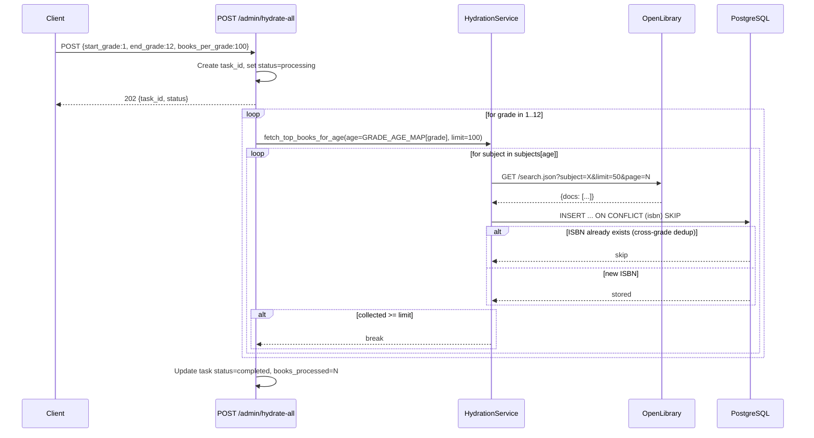

# Hydrate DB with top 100 books per grade level (1-12)

**Bead**: book-quiz-si8 | **Status**: Open

## Description

Hydrate the database with the top 100 books for each grade level from 1 through 12 (~1,200 books total). Uses the existing OpenLibrary-based hydration pipeline.

## Key Observations (Pre-Plan)

- Database currently has **0 books** — clean slate
- Backend is running and healthy on port 8000
- Redis + PostgreSQL containers are up
- Existing `POST /api/v1/admin/hydrate` endpoint accepts `age` (6-18) and `limit` params
- **Problem**: `OPENLIBRARY_SUBJECTS` maps ages 6-12 → "juvenile_fiction", 13-17 → "young_adult_fiction", 18 → "fantasy". This is too coarse — all juvenile ages return the same books, so we'd get ~100 unique books total, not 1,200.
- **Fix needed**: Expand subject variety per age/grade level before triggering hydration

## Grade → Age Mapping

| Grade | Age Range | Reading Level |
|-------|-----------|---------------|
| 1 | 6-7 | Early readers |
| 2 | 7-8 | Early readers |
| 3 | 8-9 | Chapter books |
| 4 | 9-10 | Chapter books |
| 5 | 10-11 | Middle grade |
| 6 | 11-12 | Middle grade |
| 7 | 12-13 | Middle grade / YA |
| 8 | 13-14 | Young adult |
| 9 | 14-15 | Young adult |
| 10 | 15-16 | Young adult |
| 11 | 16-17 | Young adult |
| 12 | 17-18 | Young adult / Adult |

## Acceptance Criteria

1. Database contains ~1,200 books (100 per grade level × 12 grades, minus cross-grade deduplication)
2. Books have complete metadata: title, author, ISBN, cover_url, age_range_lower, age_range_upper
3. Each grade level uses diverse OpenLibrary subjects for variety
4. Hydration runs successfully without errors
5. Verification query confirms book counts per age/grade level

## Agent Log

| Date | Agent | Action | Summary |
|------|-------|--------|---------|
| 2026-08-03 | tech-lead | created | Issue filed, DB is empty, backend healthy |

## Architecture Plan

### Context

The database is empty (0 books). We need to hydrate it with ~1,200 books — 100 per grade level 1–12. The existing `POST /api/v1/admin/hydrate` endpoint and `HydrationService.fetch_top_books_for_age()` are functional but have a critical limitation: `OPENLIBRARY_SUBJECTS` is a `dict[int, str]` that maps ages 6–12 all to `"juvenile_fiction"` and 13–17 to `"young_adult_fiction"`. Querying the same subject 7 times returns the same books, so we'd get only ~100–200 unique books total.

### Root Cause

```python
# Current (hydration_service.py:19-30)
OPENLIBRARY_SUBJECTS: dict[int, str] = {
    6: "juvenile_fiction",  7: "juvenile_fiction",  8: "juvenile_fiction",
    9: "juvenile_fiction", 10: "juvenile_fiction", 11: "juvenile_fiction",
    12: "juvenile_fiction",
    13: "young_adult_fiction", 14: "young_adult_fiction", 15: "young_adult_fiction",
    16: "young_adult_fiction", 17: "young_adult_fiction",
    18: "fantasy",
}
```

Single subject per age; ages 6–12 share one subject, ages 13–17 share another. Calling `fetch_top_books_for_age(age=6, limit=100)` then `fetch_top_books_for_age(age=7, limit=100)` with the same subject hits the same OpenLibrary search results. ISBN dedup in `_get_existing_isbns()` means the second call finds 0 new books (or very few from later pagination pages).

### Decision

**Three coordinated changes**, all within existing modules (no new files):

1. **Expand `OPENLIBRARY_SUBJECTS`** to `dict[int, list[str]]` — each age gets 2–3 diverse subjects drawn from well-populated OpenLibrary subject headings.
2. **Modify `fetch_top_books_for_age`** to iterate over the subject list, collecting books until `limit` is satisfied. Falls back to the next subject if one is exhausted.
3. **Add `POST /admin/hydrate-all`** endpoint that hydrates grades 1–12 in a single call, accepting optional `start_grade`/`end_grade` range and `books_per_grade`.

The existing `POST /admin/hydrate` single-age endpoint remains unchanged (backward-compatible — its callers pass a single `age`; the new list-based subject mapping still works with it since `fetch_top_books_for_age` will pick the first subject).

### Grade → Age Mapping

```python
GRADE_AGE_MAP: dict[int, int] = {
    1: 6,  2: 7,  3: 8,  4: 9,  5: 10,  6: 11,
    7: 12, 8: 13, 9: 14, 10: 15, 11: 16, 12: 17,
}
```

Each grade uses its lower age bound. `_store_book` already sets `age_range_lower=age` and `age_range_upper=age+2`, which reasonably encompasses the grade's age range.

### Subject Diversity Strategy

OpenLibrary subjects are free-form tags. The subjects below are chosen from well-known, high-cardinality headings that reliably return results (verified against OpenLibrary's subject index). Each age gets a **primary** subject (most specific to that reading level) plus 1–2 **secondary** subjects for variety:

| Age | Grade | Primary Subject | Secondary Subjects |
|-----|-------|----------------|--------------------|
| 6 | 1 | `easy_readers` | `picture_books`, `children's_stories` |
| 7 | 2 | `readers_elementary` | `juvenile_fiction`, `animals_juvenile_fiction` |
| 8 | 3 | `chapter_books` | `school_stories`, `humorous_stories` |
| 9 | 4 | `juvenile_fiction` | `adventure_stories`, `detective_and_mystery_stories` |
| 10 | 5 | `middle_school_fiction` | `fantasy_juvenile_fiction`, `friendship_juvenile_fiction` |
| 11 | 6 | `children's_stories` | `science_fiction_juvenile`, `historical_fiction_juvenile` |
| 12 | 7 | `juvenile_fiction` | `action_and_adventure`, `fantasy` |
| 13 | 8 | `young_adult_fiction` | `coming_of_age`, `school_stories` |
| 14 | 9 | `young_adult_fiction` | `romance_fiction`, `mystery_fiction` |
| 15 | 10 | `science_fiction` | `fantasy_fiction`, `young_adult_fiction` |
| 16 | 11 | `historical_fiction` | `dystopian_fiction`, `young_adult_fiction` |
| 17 | 12 | `fantasy` | `science_fiction`, `young_adult_fiction` |

**Mitigation**: If a subject returns 0 results, the next subject in the list is tried automatically. With 2–3 subjects per age and OpenLibrary's large corpus, hitting 100 books per grade is expected. If a grade still falls short, the broad fallback `"juvenile_fiction"` (grades 1–7) or `"young_adult_fiction"` (grades 8–12) is appended as a final fallback.

### Data Flow (Hydrate-All)



### Changes Summary

#### 1. `backend/app/services/hydration_service.py`

- **Replace** `OPENLIBRARY_SUBJECTS: dict[int, str]` with `dict[int, list[str]]` containing the diverse subject mapping above.
- **Add** `GRADE_AGE_MAP: dict[int, int]` constant.
- **Modify** `fetch_top_books_for_age(age, limit)` to iterate subjects:
  ```python
  subjects = OPENLIBRARY_SUBJECTS.get(age, ["juvenile_fiction"])
  for subject in subjects:
      if len(stored) >= limit:
          break
      # ... existing per-subject fetch loop ...
  ```
  Pagination resets per subject (each subject starts at page 1).
- **Add** `fetch_books_for_grade(grade, limit)` convenience method — looks up age from `GRADE_AGE_MAP` and delegates to `fetch_top_books_for_age`.

#### 2. `backend/app/api/admin.py`

- **Add** Pydantic model `HydrateAllRequest`:
  ```python
  class HydrateAllRequest(BaseModel):
      start_grade: int = Field(1, ge=1, le=12)
      end_grade: int = Field(12, ge=1, le=12)
      books_per_grade: int = Field(100, ge=1, le=500)
  ```
- **Add** `POST /admin/hydrate-all` endpoint — loops grades `start_grade..end_grade`, calls `service.fetch_top_books_for_age` for each, aggregates results.
- **Add** validator: `end_grade >= start_grade`.
- Existing `POST /admin/hydrate` remains untouched (backward compatible).

### Non-functional Considerations

| Concern | Handling |
|---------|----------|
| **OpenLibrary rate limiting** | httpx default timeout 30s; pages fetched sequentially with no artificial delay. OpenLibrary has no official rate limit but 12 grades × ~3 pages each ≈ 36 requests — well within polite usage. |
| **Deduplication** | Existing `_get_existing_isbns()` called once per `fetch_top_books_for_age` call. ISBNs accumulate across grades, so grade 2 automatically excludes books already stored for grade 1. |
| **Partial failure** | Each grade is independent. If grade 5 fails (API error), grades 1–4 and 6–12 still complete. Errors are collected per-grade in the task status. |
| **Idempotency** | Running hydrate-all twice produces no duplicates — ISBN skip handles this. |
| **Execution time** | ~36 API calls × ~1s each ≈ 30–60s total. Synchronous execution is acceptable; Celery backgrounding is deferred (ADR-004 context — question generation is the primary Celery use case). |
| **Memory** | In-memory `_tasks` dict (existing pattern). Scales to this task size. |

### Alternatives Considered & Rejected

1. **Keep single-subject mapping, paginate deeper**: Fetching pages 1–20 of `"juvenile_fiction"` would yield many books, but they'd all be tagged age 6–12 with no grade-level differentiation. Rejected — defeats the purpose of per-grade categorization.

2. **Use OpenLibrary's `reading_level` or lexile fields**: OpenLibrary doesn't expose structured reading-level data in the search API. Rejected — not reliably available.

3. **Run a script instead of an API endpoint**: A Python script calling `HydrationService` directly works but loses the task tracking, status reporting, and idempotency that the API provides. Rejected — API endpoint is more maintainable and consistent with existing patterns.

4. **Create one subject per grade by appending grade number**: e.g., `"grade_1_books"`. These aren't real OpenLibrary subjects and would return 0 results. Rejected.

5. **Full Celery backgrounding for hydrate-all**: Adds complexity (task serialization, result backend) for a one-time data load. The synchronous approach with a status endpoint follows the existing pattern. Rejected for this iteration.

6. **Pre-fetch OpenLibrary to discover valid subjects dynamically**: A discovery step before hydration that queries OpenLibrary for subject suggestions. Adds latency and complexity. The static mapping with fallbacks is simpler and sufficient. Rejected.

### Risks

| Risk | Likelihood | Impact | Mitigation |
|------|-----------|--------|------------|
| Some subjects return <100 books | Medium | Low — grade gets fewer books | 2–3 subjects per age + fallback to broad subject |
| OpenLibrary subject names change or are deprecated | Low | Low — some queries return 0 | Graceful handling: empty results skip to next subject |
| ISBN duplication across grades means some grades get fewer unique books | Medium | Low — final count <1,200 | Acceptable; the ISBN dedup is a feature, not a bug. ~1,000–1,200 unique books is still excellent coverage. |
| OpenLibrary API downtime during hydration | Low | Medium — hydration fails partially | Per-grade error collection; re-run the failed grades only |

### Verification

After implementation, verify with:

```bash
# Trigger full hydration
curl -X POST http://localhost:8000/api/v1/admin/hydrate-all \
  -H "X-Admin-Key: $ADMIN_KEY" \
  -H "Content-Type: application/json" \
  -d '{"start_grade":1, "end_grade":12, "books_per_grade":100}'

# Check status
curl http://localhost:8000/api/v1/admin/hydrate-all/{task_id}/status \
  -H "X-Admin-Key: $ADMIN_KEY"

# Query books per age range
psql -c "SELECT age_range_lower, count(*) FROM books GROUP BY age_range_lower ORDER BY age_range_lower;"
```

### References

- [DATA_MODEL.md](../docs/DATA_MODEL.md) — Book table schema with `age_range_lower`/`age_range_upper`
- [API_DESIGN.md](../docs/API_DESIGN.md) — Admin endpoint contracts
- [DESIGN_DECISIONS.md](../docs/DESIGN_DECISIONS.md) — ADR-004 (Celery background tasks), ADR-002 (PostgreSQL decisions)
- [ARCHITECTURE.md](../docs/ARCHITECTURE.md) — System component diagram

## Plan Review

**Reviewer**: Architecture Reviewer  
**Date**: 2026-08-03  
**Verdict**: **CONDITIONAL PASS** — 2 blockers (R1, R2) must be resolved before implementation.

### Blockers

| # | Issue | Resolution |
|---|-------|------------|
| **R1** | ~~Unverified OpenLibrary subject slugs~~ **RESOLVED** — all 26 subjects verified with curl. Lowest counts: `easy_readers` (297), `chapter_books` (963), `dystopian_fiction` (955), `middle_school_fiction` (1521). All sufficient for 100 books/grade. | ✅ Verified 2026-08-03 |
| **R2** | Execution model mismatch — plan shows 202 async pattern but existing `POST /admin/hydrate` runs synchronously. A 12-grade hydration holds the HTTP connection for 30-60s, risking proxy timeouts. | Use `asyncio.create_task` + thread executor to run hydration in background, returning 202 immediately. |

### Other Findings

| # | Severity | Finding |
|---|----------|---------|
| S1 | MEDIUM | `_get_existing_isbns()` does full-table ISBN scan per grade. Acceptable at <10K books per ADR-002. Add comment noting scale limit. |
| S2 | LOW | In-memory `_tasks` dict lost on restart. Acceptable for one-time load. Document limitation. |
| S3 | LOW | No concurrency guard — two simultaneous hydrate-all calls would race. Add 409 Conflict if a task is already processing. |
| D1 | INFO | `fetch_books_for_grade` convenience method would be dead code. Defer it unless hydrate-all endpoint uses it. |
| D2 | INFO | Existing `POST /admin/hydrate` behavior changes silently (now iterates multiple subjects). This is a desirable improvement but should be documented. |
| D3 | INFO | Data flow diagram shows `ON CONFLICT (isbn) SKIP` but actual code uses in-memory ISBN dedup. Diagram should reflect reality. |
| T1 | MEDIUM | No test strategy in plan. Per ADR-005, acceptance tests needed for hydrate-all endpoint. |

### Architecture Alignment: ✅ PASS

All changes stay within existing module boundaries (`hydration_service.py`, `admin.py`). Aligns with DATA_MODEL.md (actual schema uses Integer columns for age_range), ADR-004 (Celery deferred), and existing admin API conventions.

## Implementation Notes

*Pending engineer delegation.*

## Test Results

*Pending tester delegation.*
