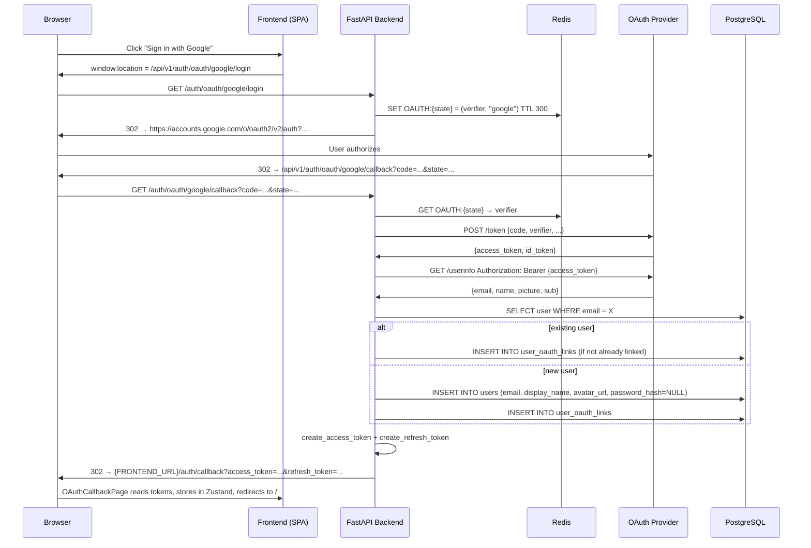
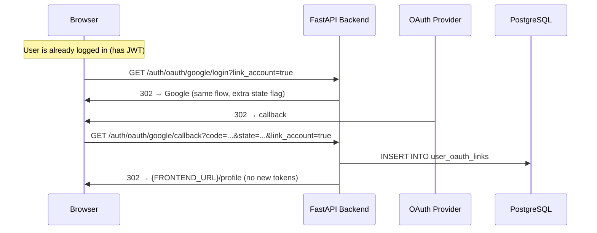

# Add Single Sign-On (SSO) with Google, Facebook, and Microsoft

**Bead**: book-quiz-tfx | **Status**: Requirements

## Description

OAuth2 SSO with Google, Facebook, Microsoft. Recommended additional: Apple, Clever, GitHub.

## Agent Log

| Date | Agent | Action | Summary |
|------|-------|--------|---------|
| 2026-08-04 | tech-lead | created | SSO feature request filed |

## Requirements Clarification

*Product Manager — 2026-08-05*

### Q1: OAuth Flow — Server-Side Authorization Code Grant with PKCE

**Decision: Server-side (Authorization Code + PKCE).**

Client-side implicit/popup flows are deprecated in OAuth 2.1 (RFC 8252). The backend
must exchange an authorization code (and PKCE code verifier) for provider tokens
server-to-server, then issue the app's own JWT. The frontend never sees provider
tokens.

**Flow:**
1. Frontend redirects browser to `/api/v1/auth/oauth/{provider}/login`
2. Backend generates PKCE `code_verifier` + `code_challenge`, redirects to provider
3. Provider calls back to `/api/v1/auth/oauth/{provider}/callback?code=...&state=...`
4. Backend exchanges code for provider tokens, fetches user info, creates/links account, issues JWT
5. Backend redirects browser to frontend callback URL with JWT in URL fragment or query (one-time code)

**Rationale:**
- Provider tokens stay server-side — no XSS leak risk
- PKCE prevents authorization code interception (required for mobile, best practice everywhere)
- Aligned with existing JWT stateless architecture
- The `state` parameter (with HMAC signing) prevents CSRF on the callback

### Q2: User Data Collected from Providers

**Decision: email (required), display_name, avatar_url.**

| Provider | Userinfo Endpoint | Fields Used |
|----------|-------------------|-------------|
| Google | `https://openidconnect.googleapis.com/v1/userinfo` | `email`, `name`, `picture` |
| Facebook | `GET /me?fields=id,name,email,picture` (Graph API v19+) | `email`, `name`, `picture.data.url` |
| Microsoft | `https://graph.microsoft.com/v1.0/me` | `mail` or `userPrincipalName`, `displayName` |

**Rationale:**
- `email` is the only strictly required field — it's the account identity anchor
- `display_name` maps to the existing `users.display_name` column
- `avatar_url` is a new optional column (`VARCHAR(500)`) on the `users` table
- We do NOT collect: provider-specific IDs (stored in link table only), birthdates, friends lists, or other sensitive scopes
- All three providers return verified emails — we can trust the email verification

**Schema changes needed:**
- `users.password_hash` → nullable (SSO-only accounts have no password)
- `users.avatar_url` → new column, nullable
- New table: `user_oauth_links(user_id, provider, provider_user_id, linked_at)`

### Q3: Account Merging — Auto-Link by Verified Email

**Decision: Auto-link when SSO email matches existing account email.**

If a user signs in with Google and `google-returned-email@gmail.com` matches
`users.email`, the OAuth provider is linked to the existing account automatically
and the user is logged in.

**Rationale:**
- OAuth providers verify emails before returning them — the email is trusted
- Prompting "Looks like you have an account, want to link?" adds friction for zero security gain
- This is the standard behavior for Auth0, Firebase Auth, Supabase Auth, and most SaaS
- Existing email/password users can add SSO trivially by logging in with the provider once

**Edge case — email mismatch:** If the SSO email doesn't match any user, a new
account is created. If the user intended to link but used a different email on
the provider, they'll end up with two accounts. Mitigation: profile page allows
linking additional providers after login.

### Q4: Password Login for SSO-Created Accounts

**Decision: No — SSO-created accounts cannot use password login.**

SSO-only accounts have `password_hash = NULL`. Until a "Set Password" feature
is built (future), these users must always log in via their OAuth provider.

**Implications:**
- `POST /auth/login` (email+password) returns 401 for accounts with `password_hash IS NULL`
- Profile page shows "Password: Not set" with a disabled "Set Password" button (future)
- The `RegisterRequest` model remains unchanged (email+password signup is separate)

### Q5: Frontend — SSO Buttons Above Email/Password Form

**Decision: Separate SSO buttons with a visual divider, NOT tabs.**

```
┌──────────────────────────────┐
│  [G] Sign in with Google     │
│  [f] Sign in with Facebook   │
│  [M] Sign in with Microsoft  │
│                              │
│  ─────── or continue ─────── │
│  Email:    [            ]    │
│  Password: [            ]    │
│  [Sign In]  [Create Account] │
└──────────────────────────────┘
```

**Rationale:**
- SSO is the preferred path for most users (faster, no password fatigue)
- Tabs hide options; visible buttons encourage SSO adoption
- This is the dominant UX pattern (Google, GitHub, Notion, Linear all use it)
- On mobile, buttons stack vertically with the same layout
- The login and signup pages share the same SSO buttons (both lead to the same
  OAuth flow — if the email matches an account, it logs in; if not, it creates one)

### Q6: User Revokes Access on Provider Side

**Decision: Handle at next login — no proactive detection needed.**

When a user revokes Book Quiz's access in their Google/Facebook/Microsoft account
settings, the provider invalidates the refresh token (which we don't store — we only
exchange the code once). The impact surfaces at the next SSO login attempt:

1. User clicks "Sign in with Google"
2. Google shows the consent screen again (because access was revoked)
3. If user re-consents, we get a new token — normal flow continues
4. If user denies, the login fails with a user-friendly error

**We do NOT:**
- Store or reuse provider refresh tokens (only need identity at login time)
- Proactively poll providers for revocation status
- Invalidate existing app JWTs if provider access is revoked (JWT is stateless — it's valid until expiry)

### Q7: Account Unlinking

**Decision: Allow unlinking only when ≥1 alternative auth method remains.**

From the profile page, users can unlink specific providers. Constraints:
- Cannot unlink the last remaining provider if `password_hash IS NULL`
- Cannot unlink all providers if `password_hash IS NULL` (must have password OR another provider)
- Cannot "delete" the password (future feature)
- Unlinking removes the `user_oauth_links` row; the user account persists

**API:**
- `GET /api/v1/users/me/oauth-links` — list linked providers
- `DELETE /api/v1/users/me/oauth-links/{provider}` — unlink (enforces above constraints)

### Q8: Environment Variables Required Per Provider

**Decision: Eight new env vars, plus one shared.**

| Variable | Description |
|----------|-------------|
| `OAUTH_GOOGLE_CLIENT_ID` | Google OAuth client ID |
| `OAUTH_GOOGLE_CLIENT_SECRET` | Google OAuth client secret |
| `OAUTH_FACEBOOK_CLIENT_ID` | Facebook App ID |
| `OAUTH_FACEBOOK_CLIENT_SECRET` | Facebook App secret |
| `OAUTH_MICROSOFT_CLIENT_ID` | Microsoft Entra ID Application (client) ID |
| `OAUTH_MICROSOFT_CLIENT_SECRET` | Microsoft client secret (value, not ID) |
| `OAUTH_REDIRECT_BASE_URL` | Base URL for OAuth callbacks (default: `http://localhost:8000`) |
| `OAUTH_FRONTEND_CALLBACK_URL` | Frontend URL to redirect after successful OAuth (default: `http://localhost:5173/auth/callback`) |

Each provider is optional — if CLIENT_ID is empty, that provider's button is hidden
and its endpoints return 404. This allows gradual rollout and makes self-hosting simple.

**Callback URLs to register with each provider:**
- Google: `{OAUTH_REDIRECT_BASE_URL}/api/v1/auth/oauth/google/callback`
- Facebook: `{OAUTH_REDIRECT_BASE_URL}/api/v1/auth/oauth/facebook/callback`
- Microsoft: `{OAUTH_REDIRECT_BASE_URL}/api/v1/auth/oauth/microsoft/callback`

---

### Summary: API Endpoints Needed

| Method | Path | Auth | Description |
|--------|------|------|-------------|
| `GET` | `/api/v1/auth/oauth/{provider}/login` | None | Initiate OAuth flow; redirects to provider |
| `GET` | `/api/v1/auth/oauth/{provider}/callback` | None | OAuth callback; exchanges code, issues JWT, redirects to frontend |
| `GET` | `/api/v1/users/me/oauth-links` | JWT | List linked OAuth providers for current user |
| `DELETE` | `/api/v1/users/me/oauth-links/{provider}` | JWT | Unlink a provider (with constraints) |

### Summary: Schema Changes

1. `users.password_hash` → `nullable=True`
2. `users.avatar_url` → new column `VARCHAR(500)`, nullable
3. New table: `user_oauth_links`
   - `id UUID PK`
   - `user_id UUID FK → users.id ON DELETE CASCADE`
   - `provider VARCHAR(20) NOT NULL` (one of: `google`, `facebook`, `microsoft`)
   - `provider_user_id VARCHAR(255) NOT NULL`
   - `linked_at TIMESTAMPTZ NOT NULL DEFAULT now()`
   - `UNIQUE(provider, provider_user_id)` — one provider ID can only be linked to one account
   - `UNIQUE(user_id, provider)` — one user can only link each provider once

### User Story Summary

1. **As a new user**, I want to sign up with my Google account, so I can start taking quizzes without creating a new password.
2. **As an existing user**, I want to link my Google account to my email/password account, so I can log in faster.
3. **As a returning user**, I want to log in with any linked provider, so I don't have to remember which method I used.
4. **As a security-conscious user**, I want to unlink a provider I no longer use, so my account is only accessible via my preferred methods.
5. **As a student**, I want to log in with my school Microsoft account, so I can use the same login I use for school.

### Acceptance Criteria (Gherkin)

```gherkin
Feature: SSO Login
  Scenario: Sign up with Google for the first time
    Given I am not logged in
    When I click "Sign in with Google"
    And I authorize Book Quiz on the Google consent screen
    Then I am redirected back to the app
    And I am logged in with a valid access token
    And my display name and avatar are set from my Google profile

  Scenario: Log in with Google after signing up
    Given I have an account linked to Google
    And I am logged out
    When I click "Sign in with Google"
    Then I am logged in immediately (no consent screen if previously authorized)

  Scenario: Auto-link when SSO email matches existing account
    Given I have an email/password account with email "alice@example.com"
    And I am logged out
    When I click "Sign in with Google" with the same email "alice@example.com"
    Then my Google account is linked to my existing account
    And I am logged in

  Scenario: Prevent unlinking last auth method
    Given I have only a Google-linked account (no password)
    When I try to unlink Google from my profile
    Then the request is rejected with a message to set a password first

  Scenario: Unlink when multiple auth methods exist
    Given I have both Google and Facebook linked
    When I unlink Facebook from my profile
    Then Facebook is removed from my linked providers
    And I can still log in with Google
```

### RICE Prioritization

| Component | Reach | Impact | Confidence | Effort | RICE Score |
|-----------|-------|--------|------------|--------|------------|
| Google SSO | High (everyone has Google) | High (fastest signup flow) | 90% | 3 days | 30.0 |
| Microsoft SSO | Medium (K-12 education focus) | High (critical for schools) | 85% | 2.5 days | 20.4 |
| Facebook SSO | Medium (social familiarity) | Medium (less for edu) | 85% | 2 days | 18.0 |
| Provider linking/unlinking (API) | Medium | Medium | 85% | 1.5 days | 14.2 |
| Avatar support | Medium | Low (nice-to-have) | 90% | 0.5 days | 13.5 |
| Frontend SSO buttons + callback page | High | Medium | 85% | 2 days | 25.5 |

**Recommended implementation order (Phase 1):** Google SSO → Microsoft SSO → Facebook SSO → Frontend UI → Linking API. All three providers can share the same OAuth infrastructure (abstract base, per-provider config).

## Architecture Plan

### Context

Book Quiz currently supports email/password authentication only. The feature adds
server-side OAuth2 (Authorization Code + PKCE) for Google, Facebook, and Microsoft,
with auto-linking by verified email and a unified account model where a user can
have zero or more OAuth providers linked alongside an optional password.

**Non-functional constraints:**
- Provider tokens must never reach the browser (no implicit/popup flow)
- Additional latency must be negligible — OAuth redirect ~200 ms overhead
- The existing JWT stateless architecture is preserved; OAuth merely becomes
  an alternative *issuance path* for the same JWT tokens
- Provider configs are optional; missing CLIENT_ID means that provider's button
  is hidden and its endpoints return 404

---

### 1. Component Design

#### 1.1 Backend: OAuth Provider Abstraction

Each provider (Google, Facebook, Microsoft) implements a shared interface so the
callback endpoint is generic and new providers can be added by registering a class.

```python
# app/services/oauth/base.py

from dataclasses import dataclass
from abc import ABC, abstractmethod

@dataclass
class OAuthUserInfo:
    provider: str          # 'google', 'facebook', 'microsoft'
    provider_user_id: str  # provider's stable user ID
    email: str
    display_name: str | None
    avatar_url: str | None

class OAuthProvider(ABC):
    @property
    @abstractmethod
    def provider_name(self) -> str: ...

    @abstractmethod
    def get_authorization_url(self, redirect_uri: str, state: str,
                              code_verifier: str) -> str: ...

    @abstractmethod
    async def exchange_code(self, redirect_uri: str, code: str,
                            code_verifier: str) -> str: ...  # → access_token

    @abstractmethod
    async def get_user_info(self, access_token: str) -> OAuthUserInfo: ...
```

Concrete implementations live in:
- `app/services/oauth/google.py` — `GoogleProvider`
- `app/services/oauth/facebook.py` — `FacebookProvider`
- `app/services/oauth/microsoft.py` — `MicrosoftProvider`

A registry dict maps provider name → provider instance at startup:

```python
# Only register providers whose CLIENT_ID env var is set.
OAUTH_PROVIDERS: dict[str, OAuthProvider] = {}
```

#### 1.2 Backend: OAuth Orchestration Service

`app/services/oauth/service.py` — `OAuthService`:
- `initiate_login(provider_name) → RedirectResponse` — generates PKCE
  code_verifier (stored in a short-lived Redis key), builds authorization URL
- `handle_callback(provider_name, code, state, db) → (User, is_new_user)` —
  validates state (HMAC), exchanges code, fetches user info, finds-or-creates
  user via auto-linking, returns tokens
- `link_provider(user_id, provider_name, oauth_user_info)` → creates link row
- `unlink_provider(user_id, provider_name)` → deletes link with constraint check
- `get_linked_providers(user_id)` → list of provider names

#### 1.3 Backend: PKCE & CSRF Storage

PKCE `code_verifier` and CSRF `state` must survive the browser redirect to the
provider. Options considered:

| Approach | Pros | Cons | Verdict |
|----------|------|------|---------|
| Signed cookie | No server storage | Cookie size limits; XSS-readable if not HttpOnly | **Reject** |
| Redis (short TTL) | Reliable; already in stack | Adds Redis dependency for OAuth | **Accept** — 5-min TTL |
| DB table | Durable | Slower; unnecessary persistence | **Reject** |

**Decision:** Redis with `OAUTH:{state}` → `(code_verifier, provider_name)`.
TTL = 5 minutes. The `state` parameter is a random 32-byte hex string (not HMAC-signed;
server-side lookup is simpler and equally secure when Redis is used).

#### 1.4 Frontend: OAuth Callback Page + SSO Buttons

**New page:** `frontend/src/pages/OAuthCallbackPage.tsx`
- Reads `code` and `state` from URL query params (or JWT from fragment via the
  one-time-code flow)
- Calls `POST /api/v1/auth/oauth/{provider}/callback`
- On success: stores tokens in `useAuthStore`, redirects to `/` or saved `redirect_to`
- On error: shows error message, links back to `/login`

**SSO Buttons Component:** `frontend/src/components/OAuthButtons.tsx`
- Queries `GET /api/v1/auth/oauth/providers` (new endpoint) to get enabled providers
- Renders buttons for each enabled provider
- Each button is an `<a href="{API_BASE}/api/v1/auth/oauth/{provider}/login">`
  (a direct link — no JS fetch for step 1, since we need the browser to follow
  the redirect chain)

**Page changes:**
- `LoginPage.tsx` — insert `<OAuthButtons />` above email/password form
- `SignUpPage.tsx` — insert `<OAuthButtons />` above form (SSO is dual-purpose:
  sign-in if account exists, sign-up if not)

---

### 2. Data Flow

#### 2.1 Full OAuth Login Sequence



#### 2.2 Token Delivery to Frontend

Two approaches considered:

| Approach | Pros | Cons | Verdict |
|----------|------|------|---------|
| URL fragment (`#access_token=...`) | Never sent to server | Visible in browser history bar briefly | **Accept** — standard practice |
| Query param (`?access_token=...`) | Simple | Logged in server logs, referrer leaks | **Reject** |
| One-time code (`?code=...`) exchanged server-side | Most secure | Extra round-trip | **Future enhancement** |

**Decision: URL fragment.** The backend redirects to:
`{OAUTH_FRONTEND_CALLBACK_URL}#access_token={jwt}&refresh_token={jwt}&token_type=bearer`

The `OAuthCallbackPage` extracts from `window.location.hash`, stores tokens, and
clears the hash via `history.replaceState`.

#### 2.3 Provider Linking (Already-Logged-In User)



This reuses the same login/callback endpoints with a `link_account=true` query
parameter (stored in state).

---

### 3. Route Design

All new endpoints live on the existing `auth` router (`/api/v1/auth`) and a new
`users` router extension.

#### 3.1 Auth Router Extensions (`backend/app/api/auth.py`)

| Method | Path | Auth | Rate Limit | Description |
|--------|------|------|------------|-------------|
| `GET` | `/api/v1/auth/oauth/{provider}/login` | None | 10/min | Initiate OAuth; redirect to provider |
| `GET` | `/api/v1/auth/oauth/{provider}/callback` | None | 10/min | Exchange code, issue JWT, redirect to frontend |
| `GET` | `/api/v1/auth/oauth/providers` | None | None | List enabled provider names |

**`GET /auth/oauth/{provider}/login`**

Query params: `?link_account=true&redirect_to=/profile` (both optional)

Responses:
- `302` → Provider authorization URL
- `404` → `{"detail": "Provider 'apple' is not configured."}`

**`GET /auth/oauth/{provider}/callback`**

Query params: `?code=...&state=...` (from provider)

Responses:
- `302` → Frontend callback URL with tokens in fragment
- `302` → Frontend login page with `?error=access_denied`
- `400` → `{"detail": "State mismatch. Possible CSRF."}`

**`GET /auth/oauth/providers`**

Response:
```json
{"providers": ["google", "microsoft"]}
```

#### 3.2 User Router Extensions (`backend/app/api/users.py` — new file)

| Method | Path | Auth | Description |
|--------|------|------|-------------|
| `GET` | `/api/v1/users/me/oauth-links` | JWT | List linked providers |
| `DELETE` | `/api/v1/users/me/oauth-links/{provider}` | JWT | Unlink provider |

**`GET /users/me/oauth-links`**

Response:
```json
{
  "providers": [
    {"provider": "google", "linked_at": "2026-08-05T12:00:00Z"},
    {"provider": "facebook", "linked_at": "2026-08-04T10:00:00Z"}
  ]
}
```

**`DELETE /users/me/oauth-links/{provider}`**

Responses:
- `204` — Unlinked
- `400` — `{"detail": "Cannot unlink the last authentication method. Set a password first."}`
- `404` — `{"detail": "Provider not linked."}`

---

### 4. Database Schema Changes

#### 4.1 Migration: `users` Table Alterations

```sql
-- 001: Make password_hash nullable (SSO accounts have no password)
ALTER TABLE users ALTER COLUMN password_hash DROP NOT NULL;

-- 002: Add avatar_url column
ALTER TABLE users ADD COLUMN avatar_url VARCHAR(500) NULL;
```

#### 4.2 Migration: New `user_oauth_links` Table

```sql
-- 003: Create OAuth link table
CREATE TABLE user_oauth_links (
    id UUID PRIMARY KEY DEFAULT gen_random_uuid(),
    user_id UUID NOT NULL REFERENCES users(id) ON DELETE CASCADE,
    provider VARCHAR(20) NOT NULL CHECK (provider IN ('google', 'facebook', 'microsoft')),
    provider_user_id VARCHAR(255) NOT NULL,
    linked_at TIMESTAMPTZ NOT NULL DEFAULT now(),

    -- One provider account can only be linked to one Book Quiz account
    CONSTRAINT uq_oauth_provider_user UNIQUE (provider, provider_user_id),
    -- One user can only link each provider once
    CONSTRAINT uq_oauth_user_provider UNIQUE (user_id, provider)
);

CREATE INDEX idx_oauth_links_user ON user_oauth_links (user_id);
```

#### 4.3 Updated `users` Table (Post-Migration)

| Column         | Type         | Constraints                      |
|----------------|--------------|----------------------------------|
| id             | UUID         | PK                               |
| email          | VARCHAR(255) | UNIQUE, NOT NULL, indexed        |
| password_hash  | VARCHAR(255) | **NULLABLE**                     |
| display_name   | VARCHAR(100) | NOT NULL                         |
| avatar_url     | VARCHAR(500) | **NEW, NULLABLE**                |
| created_at     | TIMESTAMPTZ  | NOT NULL                         |
| is_active      | BOOLEAN      | NOT NULL, default true           |

---

### 5. Configuration

#### 5.1 New Settings (`backend/app/core/config.py`)

```python
# ── OAuth ────────────────────────────────────────────────────────────
oauth_redirect_base_url: str = "http://localhost:8000"
oauth_frontend_callback_url: str = "http://localhost:5173/auth/callback"

# Google
oauth_google_client_id: str = ""
oauth_google_client_secret: str = ""

# Facebook
oauth_facebook_client_id: str = ""
oauth_facebook_client_secret: str = ""

# Microsoft
oauth_microsoft_client_id: str = ""
oauth_microsoft_client_secret: str = ""
```

#### 5.2 Provider-Specific OAuth Endpoints (hardcoded per provider)

| Provider | Authorize URL | Token URL | Userinfo URL | Scopes |
|----------|---------------|-----------|--------------|--------|
| Google | `https://accounts.google.com/o/oauth2/v2/auth` | `https://oauth2.googleapis.com/token` | `https://openidconnect.googleapis.com/v1/userinfo` | `openid email profile` |
| Facebook | `https://www.facebook.com/v19.0/dialog/oauth` | `https://graph.facebook.com/v19.0/oauth/access_token` | `https://graph.facebook.com/v19.0/me?fields=id,name,email,picture` | `email public_profile` |
| Microsoft | `https://login.microsoftonline.com/common/oauth2/v2.0/authorize` | `https://login.microsoftonline.com/common/oauth2/v2.0/token` | `https://graph.microsoft.com/v1.0/me` | `openid email profile User.Read` |

Callback URLs (registered in provider dashboards):
- `{OAUTH_REDIRECT_BASE_URL}/api/v1/auth/oauth/google/callback`
- `{OAUTH_REDIRECT_BASE_URL}/api/v1/auth/oauth/facebook/callback`
- `{OAUTH_REDIRECT_BASE_URL}/api/v1/auth/oauth/microsoft/callback`

---

### 6. Library Choice: `authlib`

**Decision: `authlib` (v1.3+) with `httpx` for async HTTP client.**

| Library | Pros | Cons | Verdict |
|---------|------|------|---------|
| `authlib` | First-class PKCE support; built-in OAuth2 client; JWK/JWT helpers; actively maintained | Additional dependency | **Accept** |
| Raw `httpx` + manual OAuth | Zero new deps; full control | Reimplementing PKCE, token exchange, error handling — bug-prone | **Reject** |
| `fastapi-sso` | Turnkey FastAPI integration | Third-party; limited provider support; less flexible | **Reject** |

Authlib provides `OAuth2Session` which handles:
- PKCE code challenge generation (S256)
- Authorization URL construction
- Token exchange (including `client_secret_post` for Microsoft)
- Token refresh (not needed — we only exchange once)

New dependency: `authlib>=1.3.0` in `requirements.txt`.

---

### 7. Security Considerations

| Risk | Mitigation |
|------|-----------|
| CSRF on callback | `state` parameter stored in Redis; verified on callback; deleted after single use |
| Authorization code interception | PKCE (S256) — code verifier never leaves the server; bound to the code exchange |
| Token leakage via URL fragment | Fragment is never sent in HTTP requests; `OAuthCallbackPage` clears hash after reading |
| Account takeover via email mismatch | Verified emails only — all three providers return `email_verified: true` |
| Brute-force OAuth initiation | Rate limit: 10/min on `/login` and `/callback` endpoints |
| Open redirect | `redirect_to` parameter validated against allowed list (frontend origin only) |
| SSO user tries password login | `POST /auth/login` returns 401 with `"detail": "This account uses Google sign-in. Please sign in with Google."` |

---

### 8. Required Changes to `POST /auth/login`

When an SSO-only account (password_hash IS NULL) attempts password login, the
current code calls `verify_password(password, user.password_hash)` which would
crash on `None`. Fix:

```python
# In AuthService.authenticate():
if not user.password_hash:
    return None  # SSO-only account — no password auth
```

The API layer can optionally enhance the 401 with a hint, but for security best
practice (don't reveal whether an account exists), keep it generic.

---

### 9. File Change Manifest

#### 9.1 Backend — New Files

| File | Purpose |
|------|---------|
| `backend/app/services/oauth/__init__.py` | Package init; exports registry |
| `backend/app/services/oauth/base.py` | `OAuthProvider` ABC + `OAuthUserInfo` dataclass |
| `backend/app/services/oauth/google.py` | `GoogleProvider` — Authlib OAuth2Session for Google |
| `backend/app/services/oauth/facebook.py` | `FacebookProvider` — Authlib OAuth2Session for Facebook |
| `backend/app/services/oauth/microsoft.py` | `MicrosoftProvider` — Authlib OAuth2Session for Microsoft |
| `backend/app/services/oauth/service.py` | `OAuthService` — orchestration: login, callback, link, unlink |
| `backend/app/models/oauth_link.py` | SQLAlchemy model for `user_oauth_links` |
| `backend/app/api/users.py` | New router: `/users/me/oauth-links` endpoints |
| `backend/alembic/versions/XXXX_add_oauth.py` | Alembic migration (password_hash nullable, avatar_url, user_oauth_links) |

#### 9.2 Backend — Modified Files

| File | Change |
|------|--------|
| `backend/app/models/user.py` | `password_hash` → `nullable=True`; add `avatar_url` column; add `oauth_links` relationship |
| `backend/app/models/__init__.py` | Export `UserOAuthLink` |
| `backend/app/core/config.py` | Add 8 OAuth env vars + 2 shared OAuth vars |
| `backend/app/services/auth_service.py` | `authenticate()` → handle `password_hash IS NULL`; new `find_or_create_oauth_user()` method |
| `backend/app/api/auth.py` | Add 3 OAuth endpoints (login, callback, providers list) |
| `backend/app/api/__init__.py` | Export `users` router |
| `backend/app/main.py` | Register `users.router`; add `/api/v1/auth/oauth` to cache-control middleware |
| `backend/requirements.txt` | Add `authlib>=1.3.0` |
| `backend/requirements-dev.txt` | Add `authlib>=1.3.0` |

#### 9.3 Frontend — New Files

| File | Purpose |
|------|---------|
| `frontend/src/pages/OAuthCallbackPage.tsx` | Parse fragment, store tokens, redirect |
| `frontend/src/components/OAuthButtons.tsx` | SSO provider buttons; fetches enabled providers |

#### 9.4 Frontend — Modified Files

| File | Change |
|------|--------|
| `frontend/src/pages/LoginPage.tsx` | Add `<OAuthButtons />` above email/password form with divider |
| `frontend/src/pages/SignUpPage.tsx` | Add `<OAuthButtons />` above form with divider |
| `frontend/src/App.tsx` | Add route: `/auth/callback` → `OAuthCallbackPage` |
| `frontend/src/services/api.ts` | Add OAuth API functions (getProviders, etc.) |
| `frontend/src/types/index.ts` | Add OAuth-related TypeScript types |
| `frontend/src/stores/authStore.ts` | Add `avatar_url` to `AuthUser`; add `hasPassword: boolean` |

---

### 10. Testing Strategy

| Layer | What to Test | Tool |
|-------|-------------|------|
| Unit | `OAuthProvider` implementations — URL construction, token exchange (mocked HTTP) | `pytest` + `unittest.mock` or `responses` |
| Unit | `OAuthService.find_or_create_user()` — auto-link logic | `pytest` + in-memory SQLite |
| Unit | `POST /auth/login` → 401 for SSO-only account | `pytest` + `TestClient` |
| Integration | Full OAuth flow with mocked provider (httpx mock) | `pytest` + `TestClient` |
| Integration | Unlink constraints (last method, password required) | `pytest` + `TestClient` |
| Frontend | `OAuthButtons` renders only configured providers | Vitest + RTL |
| Frontend | `OAuthCallbackPage` extracts fragment, stores tokens, redirects | Vitest + RTL |
| E2E | Happy path: Google sign-up, login, unlink | Playwright (future) |

---

### 11. Risks & Open Questions

| Risk | Impact | Mitigation |
|------|--------|-----------|
| Provider downtime during login | Users can't log in via that provider | Fallback message; other providers + password remain available |
| Email change on provider (rare) | Account mismatch on next login | Provider returns new email → treated as separate account. User can link from profile |
| `authlib` version conflicts | Build failures | Pin to `>=1.3.0,<2.0.0` in requirements |
| Redis not available in test env | OAuth tests fail | Use `fakeredis` for tests; OAuth endpoints skipped if Redis unavailable (with warning) |
| Frontend callback URL CORS | Fragment read blocked | Fragment is same-origin; no CORS concern. Verify CSP allows `script-src 'self'` |

**Open question for PM:** Should the `redirect_to` parameter be whitelist-validated
against a configurable list of allowed frontend paths, or restricted to the
`OAUTH_FRONTEND_CALLBACK_URL` origin only? Currently proposing origin-only check.

## Plan Review

*Pending.*

## Implementation Notes

*Pending.*

## Code Review

*Pending.*

## Security Audit

*Pending.*

## Test Results

*Pending.*
